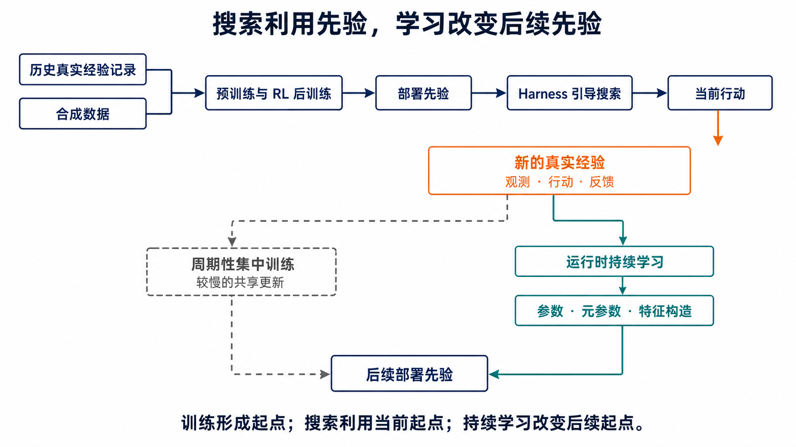
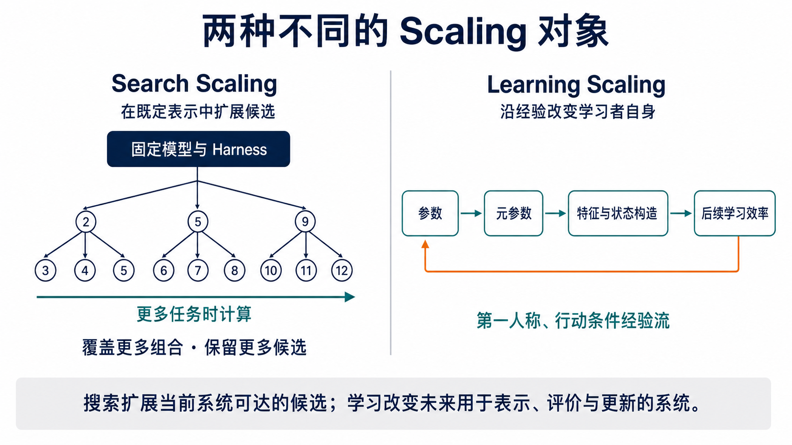
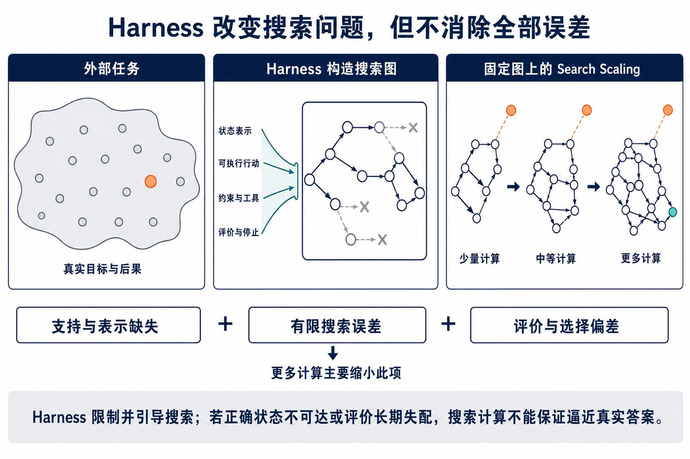
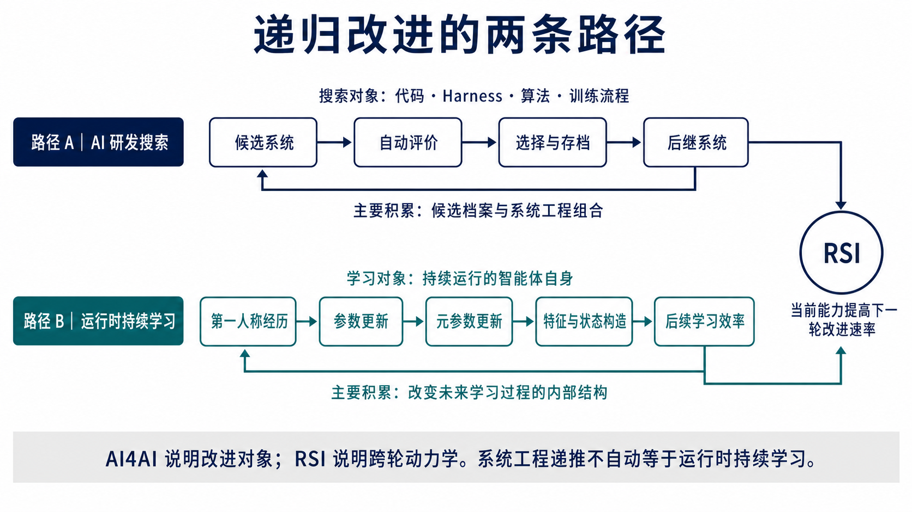
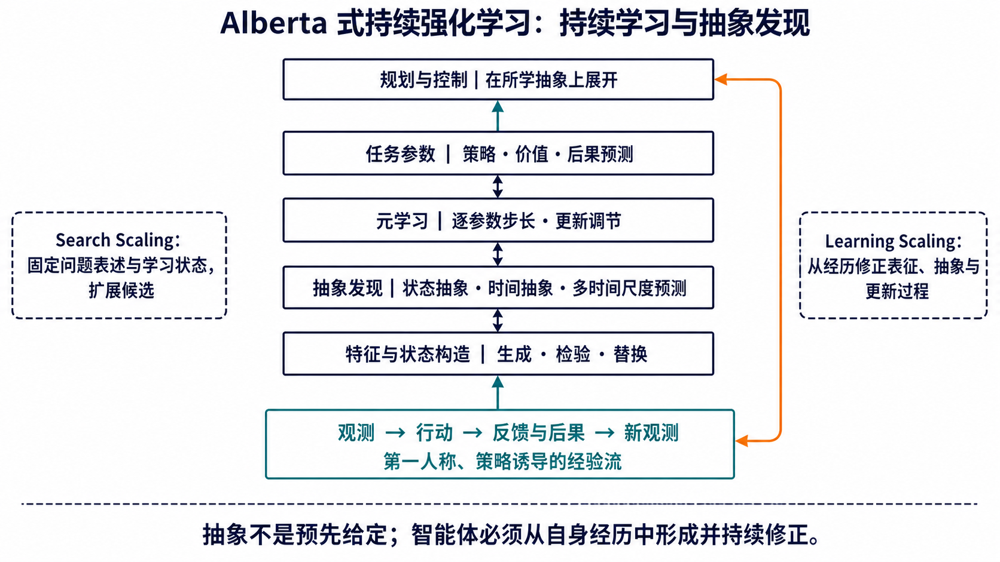
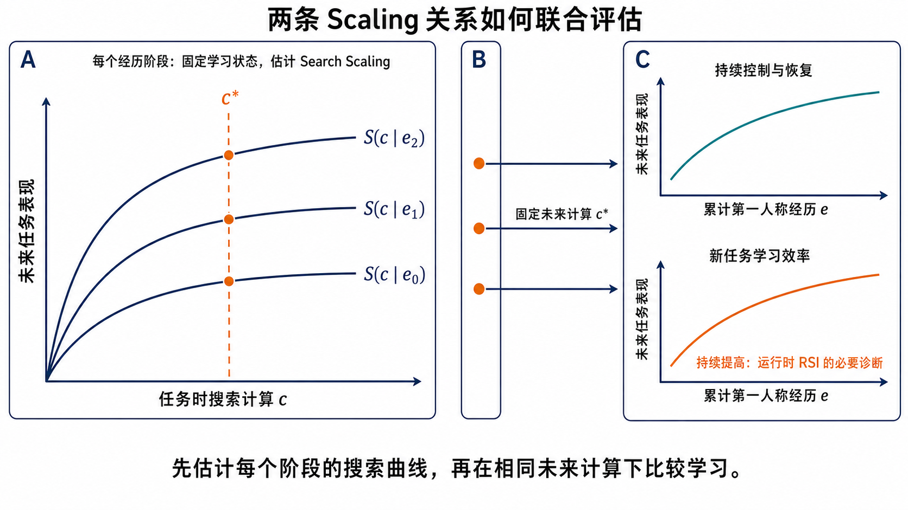

> “The limits of my language mean the limits of my world.” 
> “我的语言的界限意味着我的世界的界限。” 
> —— Ludwig Wittgenstein, [*Tractatus Logico-Philosophicus*, §5.6](https://www.gutenberg.org/ebooks/5740)

维特根斯坦的句子不是关于机器学习的形式结论。本文借用它说明一个有限边界：对搜索系统而言，状态表示、可行动作、proposal 与评价器共同规定其内部可表达的搜索问题；增加搜索计算不能自行越过这一表达边界。Learning Scaling 的必要性由此不是“再增加一类候选”，而是检验经历能否持续修正以后预测、控制与学习所依赖的状态。

## 摘要

现代 AI 的能力变化至少存在两个不同横轴。固定初始学习状态与搜索程序，增加用于状态展开、候选评价和行动规划的任务时计算，可以估计当前任务或研发提交对搜索计算的响应；让第一人称、行动条件的经历递推学习状态，在长期交互目标与未来运行条件明确时，可以估计持续控制与持续可学习性对累计经历的响应。后者同时考察长期任务效用、变化后的恢复、迁移、保持、后期可塑性与新任务学习效率。下文将两者称为 **Search Scaling** 与 **Learning Scaling**。

本文建立以下区分：历史真实经验记录、合成数据、预训练与 RL 后训练共同形成广泛而不完备的部署先验；现代 AI 随后的主导 scaling 路径主要扩展搜索的对象与效率——从输出和推理轨迹，延伸到行动、harness 与 AI 设计。Search Scaling 在既定表示、候选生成、学习目标与评价体系中覆盖更多组合；Learning Scaling 则改变以后用于表示、评价、形成中间学习目标和实施更新的学习者。Alberta 式持续强化学习给出了后者的强形式：任务参数、逐参数步长等元参数，以及特征与状态构造沿同一第一人称经验历史持续演进；持续智能体还要根据自身能力与经历构造接下来需要学习的问题。若这种演进使后续新任务学习效率提高，它构成运行时 RSI 的候选机制；如果只改善当前适应而没有提高后续改进速率，则不构成 RSI。

这一区分重新定位了预训练、RL 后训练、test-time scaling、智能体系统与 AI4AI。预训练和 RL 后训练属于模型构建期的 learning，并形成部署起点、搜索策略与行动策略；test-time scaling 在固定持久状态上展开更多任务时计算。Harness 不是被动外围，而是把外部任务编译为内部搜索图，确定可达候选支持集与有限计算下的访问分布；更高层程序又可以搜索 harness、代码、算法和训练流程。Search Scaling 因而是一族由搜索程序标记的条件曲线，而不是脱离 harness 的单一曲线；不同 harness 的曲线可以交叉，设计目标必须声明任务分布与内层运行计算。Learning Scaling 也不是它的后继阶段，而是一条需要独立实验建立的响应关系。

Self-evolving、AI4AI 与 recursive self-improvement（RSI）也不构成技术序列。它们依次询问更新算子有多少环节由系统自主执行、优化目标是否作用于 AI 系统自身，以及当前能力是否对下一轮改进速率产生正向因果效应。RSI 可以沿 AI 研发搜索形成，也可以沿运行时的持续学习形成；recursive Learning Scaling 是学习路径的重要中间条件，却不是 RSI 的充分条件。核心区分是：搜索候选随计算扩展形成的曲线，不应被解释为累计经历驱动的学习曲线；同样，更新自主性、面向 AI 研发或单个后继系统的分数提高，都不能单独推出 RSI。

---

## 动机：自动驾驶中的模拟、搜索与真实经历

自动驾驶系统通常把已经记录的真实道路经验与模拟生成的合成数据用于集中训练。前者保留已经发生的交通交互，后者可以系统改变天气、道路参与者、传感器与稀有路况。预训练把二者转化为道路表征、行动后果预测与候选生成先验，RL 后训练依据奖励、安全约束或可执行评价塑造行动、回退与停止倾向。模型由此获得较强部署起点，但其状态表示、转移预测和评价过程仍是对真实道路的近似。

[SMARTS](https://proceedings.mlr.press/v155/zhou21a.html) 将不同道路参与者之间的交互作为自动驾驶强化学习的核心问题，并以可扩展模拟平台支持多智能体研究。它说明模拟器能够系统组织训练条件，却不意味着模拟器已经完整表达未来道路交互。

当前驾驶中，harness 把传感器观测、合法行动、安全约束和评价规则组织为搜索图。固定模型与 harness，比较 4、16 或 64 条制动、等待、转向和绕行轨迹，估计的是任务级 Search Scaling。更多计算可以减少安全轨迹已经可达却未被访问的有限搜索误差；它不能保证模拟器遗漏的摩擦变化、传感器漂移或陌生交通行为进入内部表示，也不能使近似评价自动等于真实长期效用。

工程团队可以在运行后收集道路记录、修改模拟器并集中训练新的共享模型。这属于现实反馈驱动的周期性集中更新。Learning Scaling 研究另一项关系：部署智能体能否沿自身行动诱导的第一人称经验流持续更新，并在相同未来任务时计算下改善长期控制，同时维持旧能力保持与后期可塑性。该研究目标不等同于在安全关键系统中直接实施无约束在线参数更新。

*动机示意｜历史真实经验记录与合成数据通过预训练和 RL 后训练形成部署先验；部署交互产生新的真实经验。新的经验可以进入周期性的集中训练，也可以通过运行时持续学习改变参数、元参数与特征构造。*

> **Search Scaling 固定跨次重复的初始学习状态与搜索规则，以当前任务或设计轮次的搜索计算为横轴；Learning Scaling 先声明长期交互目标与经验产生过程，在可比未来运行条件下，以第一人称、行动条件的累计经验为横轴，同时考察持续控制与持续可学性。**

这一定义规定了两条曲线各自的自变量与控制条件。这里所说的 Learning Scaling 是一个操作性研究定义：除了经历曲线，还包括实际经验流中的长期控制与恢复、迁移、保持、后期可塑性，以及智能体在长期运行后段学习新规律的效率。

*图 1｜Search Scaling 在固定模型与 harness 下扩展可达候选；Learning Scaling 使参数、元参数、特征与状态构造沿经验演进，并以持续控制和后续学习效率检验这种演进是否有效。*

同一分界贯穿后文的三组比较：reasoning 与智能体系统提高的能力来源，包括训练期学习、任务时计算与部署期更新；self-improving harness、AI4AI 与持续学习之间的关系；RSI 反馈对候选搜索吞吐与新任务学习效率的不同影响。

两项响应关系的比较共同报告三组设计要素：独立重复的起点，以及任务内状态与学习状态的重置方式；被改变的自变量是当前任务计算 \(c\) 还是累计经历 \(n\)；比较中保持一致的 proposal、评价器、运行条件与评估集合。

---

## 1. 训练、测试与部署发生在不同时间段

这些术语不按模型类型划分。更稳定的切口有两个：过程发生在训练、测试还是部署期间；任务状态清空后，哪些变化仍会进入未来任务。图 2 给出时间关系，正文随后说明每个术语的操作性含义。

**Learning、training、testing 与 deployment**

**Learning（学习）**指经历引起持久状态更新，并由该更新影响后续条件中的预测、决策或再学习。持久状态可以由参数、长期记忆、可复用策略结构、控制结构和更新规则共同构成。当前上下文中的临时状态变化不满足这一条件；参数或记忆持续变化也不预设影响有利。

**Training（训练）**指依照数据、目标函数、优化程序与停止条件实施的更新过程。Training 是实现 learning 的一类方法，但训练完成不保证迁移、保持或学习效率提高。预训练、监督微调和 RL 后训练均属于训练过程。

**Testing（测试）**指在预先规定的任务集合、指标和运行条件下进行评估。标准测试不以测试项更新被测系统；若允许适应，应将适应数据与最终评估数据分离，并明确记录更新边界。

**Deployment（部署）**指系统面向实际任务、用户或环境运行的时期。部署可以只包含推理，也可以包含持久更新。因而 deployment 与 testing 不是同义词，test-time 也不必等同于实际部署。

**Inference、reasoning、search 与 planning**

设持久状态为 \(z\)，任务为 \(x\)，任务时计算量为 \(c\)。Inference（推断）可写为

\[
y=F(z,x;c).
\]

Reasoning（推理）是形成判断或行动所需的中间计算，可以在隐状态、文本、程序或结构化表示中进行；自然语言思维链只是其中一种实现。

Search（搜索）指在有限计算下表示候选状态、规定可行动作、生成或展开候选、分配计算、评价轨迹并决定停止与提交。令

\[
h=(\phi_h,\mathcal A_h,q_h,v_h,\mu_h,\sigma_h)
\]

表示一项搜索程序，其中各项依次对应状态表示、可行动作、proposal / 展开、评价、计算分配、停止与提交。搜索运行可写为

\[
T_c\sim\operatorname{Search}_h(x,z;c),
\qquad
\hat u_c=\sigma_h(T_c).
\]

下文将生成或展开候选的分布与程序称为 **proposal**，将比较候选的函数称为**评价器**；当评价可以通过测试、证明检查或约束检查确认候选是否满足明确条件时，评价器也称为 **verifier**。proposal 决定哪些候选进入轨迹，评价器和提交规则决定哪些候选获得后续计算并最终被采用。

计算量 \(c\) 可以具体记录为生成 token 数、候选数、搜索节点数、采样轨迹数、工具调用数、GPU-seconds 或墙钟时间。搜索并不要求持久状态 \(z\) 更新。

Planning（规划）面向具有时间次序的行动及其后果：

\[
\begin{aligned}
\hat a_{0:H}
&=\arg\max_{a_{0:H}}
\mathbb E\!\left[\sum_{h=0}^{H}\gamma^h r(s_h,a_h)\right],\\
s_{h+1}&\sim P(\cdot\mid s_h,a_h).
\end{aligned}
\]

规划问题常由搜索算法求解，但二者并不等价。检索文档、生成多条证明路径和比较程序候选属于搜索；只有当候选表示未来行动序列或策略，并显式考虑状态转移与延迟后果时，才构成规划。

**Agent 与 adaptation**

Agent（智能体）指在持续交互中接收观测、选择行动，并使后续观测或反馈受先前行动影响的系统。语言模型、工具、记忆和 harness 可以共同构成智能体的策略与控制结构；一次无状态的模型调用则不必归为智能体。

**Harness** 指围绕基础模型组织执行的系统层。从 search 的角度，它实现或规定 \(h\)：把交互过程表示为状态，限制可行动作，安排上下文、工具、子智能体与工作流，实施评价、计算分配、停止和提交。harness 可以在模型参数不变时显著影响搜索，也可以进入高层设计搜索或成为学习状态的一部分；是否含有 learning，仍取决于更新是否在后续新条件中继续发挥作用。

持续强化学习研究一个历史依赖的**连续智能体—环境交互过程**，而不是一组彼此独立的模型检查点。时刻 \(t\) 的学习状态由先前观测、行动、奖励与更新共同决定，并继续参与未来行动选择。参数、记忆、可复用策略结构与 harness 可以构成学习状态的不同坐标，但任一坐标的保留或替换都不能单独定义过程是否连续。配对比较应从共同的初始智能体分布与外生环境过程产生独立轨迹，使各分支按照自身策略形成第一人称历史，并分别声明任务内状态、学习状态与环境过程的重置条件。

**任务内状态**包括当前 context、scratchpad、搜索树、临时缓存与当前候选，通常在任务结束或评估前清空。**持久状态**在任务重置后保留，包括参数、长期记忆、可复用策略结构、harness 配置与更新规则。两类状态都能影响行为，但只有后者能够承载这里讨论的跨任务 learning。

Adaptation（适应）指系统因当前条件而调整内部状态或行为。上下文累积、搜索树扩展、缓存写入与任务内参数更新均可形成适应，但只有跨任务保留并影响后续条件的状态变化，才满足上述 learning 定义。因此，test-time adaptation 与 Learning Scaling 不能直接等同。

**历史真实经验记录、合成数据与部署后的第一人称经历**

历史真实经验记录指由现实用户、设备或环境交互产生并被保存的数据。它可以包含人类行动、其他策略的交互轨迹，也可以包含同一智能体较早的运行记录；进入集中训练后，它仍是从既有历史中抽取的外部训练输入。它为训练提供来自现实过程的参照，却只覆盖已经发生并被采集的条件，也不能提供未执行行动的反事实后果。

合成数据至少包括三类：生成模型产生的文本、图像或任务；模拟器产生的状态转移与传感器信号；自博弈、程序执行或形式规则产生的轨迹与评价。三者不能用同一可靠性判断概括。规则完备的自博弈可以由真实胜负提供稳定评价；可执行验证能够排除部分错误候选；物理模拟可以系统改变已知参数。生成器、模拟器和评价器无法表达的因素，则不会仅因合成样本增加而出现。

第一人称经历由当前智能体的策略与环境共同产生。行动改变以后观测和反馈，更新又改变后续行动分布。它不是另一种静态数据类别，而是一种历史依赖的生成过程。Learning Scaling 关心的是这一过程能否在长期目标下持续改变以后控制与学习，而不是部署期间累计了多少日志。

**三类响应关系**

为避免把所有参数更新都称为同一种 scaling，下文区分三类响应关系：

- **training scaling**：增加训练数据、参数量或训练计算，以得到更强的已训练模型；
- **experience scaling**：在任务时运行条件固定时，累计经历增加与未来任务表现之间形成稳定关系；
- **Learning Scaling**：在 experience scaling 的基础上，同时满足跨条件迁移、旧能力保持和后期可塑性，并使新任务学习效率在可比条件下不发生系统性衰减；递归形式进一步要求该效率跨阶段提高。

预训练与 RL 后训练都包含 learning，但这里的 Learning Scaling 讨论的是另一项 Scaling 关系：同一持续运行系统如何利用自身经历，而非训练流程如何产生新的发布模型。

| 环节 | 信号来源 | 形成或改变的状态 | 主要限制 |
|---|---|---|---|
| 历史真实经验记录 | 已发生的现实交互 | 来自现实过程的训练参照 | 历史覆盖有限；不含未执行行动的反事实后果 |
| 合成数据 | 生成模型、模拟器、自博弈、程序执行或形式规则 | 设计条件中的样本与训练信号 | 继承生成机制与评价过程的遗漏 |
| 预训练 | 大规模真实经验记录与合成数据上的预测目标 | 面向多个部署实例共享的表征、proposal 与后果预测先验 | 训练目标与部署长期效用并不相同 |
| RL 后训练 | 策略轨迹、奖励、偏好、verifier 与环境反馈 | 推理、搜索、工具使用、行动与评价倾向 | 训练结束后出现的新规律尚未进入共享状态 |
| Harness 与 Search Scaling | 当前输入、工具反馈、规则约束与任务时评价 | 内部搜索图、访问分布与提交项 | 不能普遍消除不可达行动、表示遗漏与评价偏差 |
| 离线模型换代 | 多个部署实例汇集并筛选的运行记录 | 周期性更新的群体共享能力 | 存在时间延迟，并弱化私有与路径相关经历 |
| 运行时持续学习 | 当前智能体行动所诱导的第一人称经验流 | 继续参与以后交互的预测、控制与再学习状态 | 更新本身不保证长期控制、保持或后期可塑性 |

[AlphaZero](https://arxiv.org/abs/1712.01815)说明，在规则与终局评价完整的棋类中，自博弈可以产生高价值合成轨迹。[Tobin 等人](https://arxiv.org/abs/1703.06907)在特定机器人视觉与抓取任务中展示了 domain randomization 的 sim-to-real 转移。另一方面，[Shumailov 等人](https://www.nature.com/articles/s41586-024-07566-y)研究后继生成模型反复从前代生成数据学习的过程，并报告尾部信息丢失与 model collapse。这些工作共同说明：合成数据并非天然有效或天然有害，其作用取决于生成机制是否覆盖任务相关因素，以及评价与现实校准是否提供独立校正。

[Sutton 与 Javed](https://sequoiacap.com/podcast/rich-sutton-and-khurram-javed-why-ai-models-stop-learning-and-how-to-start-it-again)的观点针对的是把人类设计的合成数据视为超越有限互联网、并替代开放世界持续经验的通用途径。在 Big World 前提下，任何有限模拟器都只能表达真实世界的一小部分；Javed 在同一讨论中也明确承认模拟学习的价值，并提出由智能体从自身经验学习、再以持续学习修正模型。因而争议不在于是否使用合成数据，而在于合成过程能否接受独立于当前近似的现实校正，以及智能体部署后是否仍能从新经验学习。

RL 后训练可以使用策略自身产生的交互轨迹，meta-RL 还可以训练适应程序，因此两者并非“没有学习”。关键分界是：具有起止与重置条件的集中训练最终形成面向许多部署实例共享的检查点；Learning Scaling 则跟踪模型投入持续运行以后，一个连续交互学习过程能否从自身行动诱导的经历继续形成更好的长期控制与学习能力。预训练和 RL 后训练可以提供更好的初始学习程序，却不能代替这条运行时经验曲线。

---

## 2. 两类响应关系采用不同的自变量与控制条件

形式化从两项控制变量实验开始。第一项实验反复复制同一持久状态，仅调整每项任务可使用的候选数、工具调用或运行时间；第二项实验让同一智能体经历更多任务并保留更新，但每次未来评估均采用相同运行条件。Search Scaling 的自变量是任务时计算 \(c\)，累计经历不进入持久状态；Learning Scaling 的自变量是经历 \(n\)，未来任务计算固定为 \(c_0\)。

设智能体在时刻 \(t\) 的持久状态为

\[
z_t=(\theta_t,m_t,h_t,u_t),
\]

其中 \(\theta_t\) 为参数，\(m_t\) 为长期记忆与可复用策略结构，\(h_t\) 为工具和控制结构，\(u_t\) 为更新规则。

全文采用下列符号：

| 符号 | 含义 |
|---|---|
| \(x_t\)、\(D\)、\(D_{new}\)、\(D_{\mathrm{adapt}}\) | 当前任务、评估任务分布、未来未见任务分布与新任务学习效率所用的新任务分布 |
| \(z_t\) | 智能体的持久状态，包括参数、长期记忆、可复用策略结构、控制结构与更新规则 |
| \(c_t\) | 单个任务的运行计算，以 token、候选数、搜索节点、工具调用、GPU-seconds 或墙钟时间记录 |
| \(e_t\) | 由观测、行动、反馈及其时间关系组成的经历 |
| \(n\) | 截至评估时刻的累计经历数 |
| \(h=(\phi_h,\mathcal A_h,q_h,v_h,\mu_h,\sigma_h)\) | 搜索程序，以及状态表示、可行动作、proposal、评价、计算分配、停止与提交 |
| \(\ell\)、\(s^{(\ell)}\) | 搜索层级，以及该层级的搜索程序、候选档案与提交状态 |
| \(J_{\mathrm{task}}\)、\(J_{\mathrm{future}}\) | 当前任务评估与未来未见任务评估 |
| \(m\)、\(\rho\)、\(n_{\rho,t}\) | 新任务内的经历数、相对性能阈值，以及长期运行阶段 \(t\) 达到该阈值所需的经历数 |
| \(\eta_t(\rho)\) | 在匹配的新任务上达到相对性能阈值的效率，由 \(n_{\rho,t}\) 的倒数聚合得到 |
| \(C_i^-\)、\(C_i^+\)、\(C_U\)、\(H\) | 冻结/更新分支的逐项任务成本、持久更新成本与未来任务分布；一次比较只采用一种计量单位 |

全文以小写 search、learning、training 指相应过程，以 Search Scaling、Learning Scaling 与 training scaling 指在明确横轴和控制条件下测得的响应关系。

### 2.1 任务级 Search Scaling：固定 \(z_t\)，增加 \(c\)

单个任务中的搜索轨迹与提交项由

\[
T_c\sim\operatorname{Search}_h(x_t,z_t;c),
\qquad
\hat u_c=\sigma_h(T_c)
\]

产生。Search Scaling 研究

\[
J_{\mathrm{task}}(c\mid h,z_t,D)
=
\mathbb E_{x\sim D}
\left[J(\hat u_c,x)\right],
\]

该函数刻画一项条件响应：同一持久状态与同一搜索程序获得更多生成、测试、搜索或规划计算后，平均任务表现如何变化。研究 \(\partial J_{\mathrm{task}}/\partial c\) 时，必要控制条件是 \(z_t\) 与 \(h\) 固定。任务结束后可以满足

\[
z_{t+1}=z_t.
\]

长推理、best-of-\(N\)、self-consistency、树搜索、verifier-guided search、工具调用、多智能体并行和递归委派均可按这一函数评估。它们可以提高任务评估，却不要求系统从本次经历中形成跨任务更新。

单次搜索运行内部可以形成搜索树、context、中间稿或候选档案。固定 \(z_t\) 与 \(h\) 指每次独立重复均从相同初始持久状态出发，并采用相同状态表示、可行动作、proposal、评价、计算分配、停止与提交规则；它不要求运行中的每个搜索节点保持不变。若比较中替换上述任一项，差异已经混入搜索程序本身的变化。若入选候选进入下一项独立评估的持久状态，这次提交作为跨边界更新另行记录。

### 2.2 Learning Scaling：固定 \(c_0\)，增加累计经历

智能体第一人称的部署经历记为

\[
e_t=(o_t,a_t,f_t,o_{t+1},\ldots),
\]

其中 \(o_t\) 为观测，\(a_t\) 为行动，\(f_t\) 为奖励、环境反馈或其他训练信号。持久更新为

\[
z_{t+1}=U(z_t,e_t).
\]

令 \(H_t\) 为截至时刻 \(t\) 的完整历史。策略 \(\pi_{z_t}\) 与环境共同诱导后续经历：

\[
p(H_{t+1}\mid H_t)
=
\pi_{z_t}(a_t\mid H_t)\,
p(o_{t+1},f_{t+1}\mid H_t,a_t).
\]

这个分解使 Learning Scaling 与按时间排列的离线训练数据产生根本区别：智能体只能从自身历史出发选择行动，行动决定以后观测与反馈的分布，更新又改变后续行动。累计经历 \(n\) 是第一人称、策略诱导经验流中的时间索引，不是独立同分布样本的简单计数。

持续强化学习的目标必须在更新规则之前声明。对无自然终止的 continuing control，一项可能的目标是在长度为 \(w\) 的未来时间窗中估计奖励率：

\[
J_{\mathrm{run}}(n,w)
=
\mathbb E\!\left[
\frac{1}{w}\sum_{k=0}^{w-1}R_{n+k+1}
\right].
\]

奖励率不是默认答案。折扣回报、约束效用、风险敏感目标或任务特定的长期准则都可以成立，但必须明确其时间语义、约束和恢复要求。仅以参数变化、记忆增长、旧基准保持或 next-token loss 下降作为目标，无法回答智能体在实际交互中是否实现了更好的长期控制。

具有明确任务边界时，未来新任务提供另一组诊断。此时在累计经历水平 \(n\) 截取连续交互过程中的学习状态，清空任务内搜索状态，并在未来未见任务集合 \(D_{new}\) 上固定每题生成 token 数、工具调用数、环境交互数和墙钟时间 \(c_0\)，评估

\[
J_{\mathrm{future}}(n\mid c_0)
=
J(z_n;D_{new},c_0),
\]

其中 \(n\) 为累计经历数。评估时不允许智能体通过增加当前任务计算获得优势；任何差异都必须由经历进入 \(z_n\) 后形成。若 \(J_{\mathrm{run}}\) 或 \(J_{\mathrm{future}}\) 随 \(n\) 形成稳定响应，且变化不能由任务内上下文或额外任务时计算解释，则系统呈现 experience scaling。这是 Learning Scaling 的必要条件，但还不是充分条件。长期记忆中的近邻检索可以承载 experience scaling；若提高仅限于重复项或高度相似项，则尚未满足跨条件迁移要求。任务序列中的提高若伴随实际交互回报下降，也不能支持持续强化学习意义上的改善。

累计经历 \(n\) 首先是给定任务到达过程、环境动力学与反馈渠道下的系统内横轴，而不是跨系统通用的资源单位。跨系统比较还需共享可比的机会过程，并报告经历的任务构成、反馈密度与可行动作集合；否则相同经历数可能对应不同的信息条件。

这条经历曲线衡量的是：先前经历进入持久状态后，智能体面对未来任务时从什么水平开始。它并不直接衡量智能体获得一种新任务需要多少新经历。为评估后者，在长期运行阶段 \(t\) 采样此前未见的适应任务 \(q\sim D_{\mathrm{adapt}}\)，记智能体在任务内获得 \(m\) 条新经历后的表现为 \(J_{t,q}(m)\)。适应曲线的每个点采用相同的任务时运行条件、反馈形式与更新机会。令 \(J_q^\star\) 为预先声明的参考上限，\(0<\rho<1\) 为需要弥合的相对差距，则

\[
n_{\rho,t}(q)
=
\min\left\{
m:
\frac{J_{t,q}(m)-J_{t,q}(0)}
{J_q^\star-J_{t,q}(0)}
\ge \rho
\right\}.
\]

这里只纳入 \(J_q^\star>J_{t,q}(0)\) 的任务。以达到阈值所需经历数的倒数定义阶段性的新任务学习效率：

\[
\eta_t(\rho)
=
\mathbb E_{q\sim D_{\mathrm{adapt}}}
\left[
\frac{1}{1+n_{\rho,t}(q)}
\right].
\]

**数值示例：较高起点不等于更快学习。** 假设某个新任务的参考上限为 \(J_q^\star=80\)，并取 \(\rho=0.5\)。运行早期的智能体从 \(J_{early,q}(0)=20\) 开始，需要达到

\[
20+0.5(80-20)=50;
\]

运行后期的智能体从 \(J_{late,q}(0)=35\) 开始，则需要达到

\[
35+0.5(80-35)=57.5.
\]

若前者需要 12 条新经历、后者需要 7 条，则 \(n_{0.5,early}=12\)、\(n_{0.5,late}=7\)，对应单任务效率由 \(1/13\) 变为 \(1/8\)。比较的是弥合相同比例能力差距所需的经历，而不是谁的初始分数更高。单项任务上的这组示意数值不能建立响应关系；正式实验仍需覆盖多个新任务、多个 \(\rho\) 与多个长期运行阶段。

若任务在预设的最大经历数内未达到阈值，记 \(n_{\rho,t}(q)=\infty\)，它对 \(\eta_t(\rho)\) 的贡献为零；汇总值之外还应报告达标比例、经历数分布与不确定性。若参考上限难以可靠给定，应报告完整适应曲线，并在所有被比较系统均可达到的多个绝对阈值上报告 \(n_{\tau,t}\)，而不是选择单一阈值。持续交互中，只有当 \(J_{\mathrm{run}}(n,w)\)、恢复时间或相应长期目标在多个经历区间中形成可重复响应，并且迁移、保持、后期可塑性与 \(\eta_t(\rho)\) 在匹配的任务分布、先验与运行条件下没有被牺牲时，下文才称其为 Learning Scaling；具有自然任务边界的比较再以 \(J_{\mathrm{future}}(n\mid c_0)\) 补充。若 \(\eta_{t+1}(\rho)>\eta_t(\rho)\) 能在多个长期运行阶段和多个 \(\rho\) 上重复出现，则进入 recursive Learning Scaling：更新过程本身也在改善，即 learning-to-learn during deployment。

Learning Scaling 因而是随累计经历变化的多输出响应剖面，而不是由一个总分表示的单条标量曲线：

\[
\mathcal L(n)
=
\bigl(
J_{\mathrm{run}},
T_{\mathrm{recover}},
\mathrm{Reg}_{\mathrm{dyn}},
J_{\mathrm{future}},
R_{\mathrm{old}},
P_{\mathrm{late}},
\eta
\bigr)_n.
\]

其中 \(T_{\mathrm{recover}}\) 记录环境或目标变化后的恢复时间，\(\mathrm{Reg}_{\mathrm{dyn}}\) 记录相对于可行时变参照的累计差距。\(J_{\mathrm{future}}(n\mid c_0)\) 只描述 experience scaling 的一项诊断；实际长期控制、恢复、可迁移任务分布、保持、后期可塑性与新任务学习效率应共同报告。任务序列诊断不能替代智能体在自身行动诱导的经验流中是否实现更好控制。

在代码智能体例子中，\(J_{\mathrm{future}}(n\mid c_0)\) 评估经历九十九个仓库后，智能体在新仓库上的固定条件起点；\(n_{\rho,t}\) 则评估它需要多少次新的测试—修订交互，才能掌握此前未见的构建规则。前者提高而后者不变，说明智能体积累了可迁移能力，但尚未表明学习新规律的速度提高。

两种响应关系的实验设计可以直接并列：

| 实验条件 | 任务级 Search Scaling | Learning Scaling |
|---|---|---|
| **核心问题** | 同一持久状态能否用更多任务时计算找到更优解 | 累计经历能否在相同运行条件下改善未来能力，并长期维持新任务学习效率 |
| **变化量** | 单任务计算 \(c\) | 累计经历 \(n\) 与持久更新 |
| **固定量** | \(z_t\)、任务分布与评价规则 | 长期目标、经验产生过程，以及未来 token、工具调用、交互和墙钟时间 \(c_0\) |
| **任务结束后** | 任务级比较要求 \(z_{t+1}=z_t\) | 必须存在跨任务保留的 \(z_{t+1}=U(z_t,e_t)\) |
| **独立重复与评价轨迹** | 从同一初始学习状态产生的当前任务轨迹 | 从共同初始分布产生的连续交互轨迹；任务序列诊断另行清空任务内状态 |
| **典型限制** | proposal 覆盖、评价器排序、搜索深度与停止规则 | 长期目标、策略诱导经验、恢复、迁移、保持、后期可塑性与更新稳定性 |
| **仍需另行检验** | 持续学习、Self-evolving 或 RSI | 更新过程自身改善或 RSI |

### 2.3 Search Scaling 是有限计算下的 guided search

Search Scaling 不能仅用“生成更多候选”定义。面对不能穷举的组合空间，搜索算法必须决定状态怎样表示、哪些操作可执行、从何处展开、何种中间状态继续获得计算，以及何时停止。[A*](https://doi.org/10.1109/TSSC.1968.300136)以路径代价和启发函数安排节点展开；[No-Free-Lunch 定理](https://doi.org/10.1109/4235.585893)则说明，对全部目标函数作均匀平均时，不存在普遍更优的优化算法。特定搜索程序之所以有效，必然利用了任务分布中的非均匀结构。

Learning 可以形成这种 guidance。[AlphaZero](https://arxiv.org/abs/1712.01815)用学习得到的 policy 引导树的展开，并以 value 评价叶节点；任务执行时，固定后的 policy、value 与 MCTS 共同构成搜索程序。因而，Search Scaling 研究的不是无结构计算，而是固定 inductive bias 后，算法如何把额外计算分配给内部搜索状态。

**大模型作为通用搜索器的能力来源**

“通用搜索器”在这里具有有限含义：同一个参数化生成器能够以不同任务描述、上下文和反馈为条件，在多种符号或行动空间中提出候选；它不表示该生成器对所有问题均有优势。其第一项来源是预训练形成的条件 proposal distribution。自回归模型将序列概率写为

\[
q_\theta(y_{1:T}\mid x)
=
\prod_{t=1}^{T}q_\theta(y_t\mid x,y_{<t}).
\]

异质训练语料使 \(q_\theta\) 对语言、代码、数学表达、常见任务结构与行动描述形成广泛先验。该先验至少以三种方式进入搜索：给定当前状态与候选行动，模型可以预测可能出现的后续状态、工具返回或语言反馈，充当近似的**环境后果预测器**；模型可以提出下一步行动或完整轨迹并分配分支概率，充当 **proposal 与行动策略**；模型也可以比较中间状态、预测成功概率或判断候选质量，充当**价值估计与近似评价器**。同一组参数可以由不同上下文、提示与工具接口激活为这些不同角色。这里发生的是 amortized search guidance：训练计算预先学习任务分布的统计结构，运行时无需从均匀分布开始提出候选。正确候选若不在模型支持中，或只有极低概率，广泛先验仍不能保证求解。

第二项来源是 RL 后训练对轨迹分布的重塑。终局奖励、过程反馈、工具执行记录和多步信用分配可以提高有效分解、顺序修订、工具选择与适时终止的概率，并共同调整环境后果预测、行动策略、计算分配与评价倾向。这些功能由参数学习形成，任务时则以固定参数展开。

第三项来源是自回归推断的搜索结构。每个前缀 \(y_{<t}\) 可视为隐式树节点，token、工具调用或环境行动构成后继边。并行采样扩展多个分支，顺序修订沿先前候选与反馈继续展开，verifier 或环境返回值提供排序与剪枝。[Large Language Monkeys](https://arxiv.org/abs/2407.21787)在代码、形式证明等任务上报告 repeated sampling 随采样数扩大候选覆盖；[Snell 等人](https://arxiv.org/abs/2408.03314)则表明，搜索成效取决于基础模型、任务难度以及计算在并行采样、顺序修订和 verifier 引导之间的分配。[TS-LLM](https://proceedings.mlr.press/v235/wan24c.html)用学习得到的价值函数引导大模型树搜索，[ToolPRM](https://aclanthology.org/2026.acl-long.855/)则在函数调用的结构化输出中以细粒度过程评价引导 beam search。因此，大模型的运行时能力来自学习得到的 proposal、评价与有限计算展开的共同作用。

大模型本身仍不是完整搜索算法。\(q_\theta\) 只对模型可表示的后继序列给出条件概率；它不独立规定外部任务状态、合法行动、权限、环境反馈、回滚条件或提交语义。Harness 的必要性由此产生：它把通用的序列 proposal 转换为特定环境中可执行、可评价且可以分配计算的搜索过程。

外部任务与内部搜索空间需要分开表示。令 \(\Omega(x)\) 为任务 \(x\) 按外部语义允许的终端行为集合。它规定哪些提交项有定义以及如何评估，却不规定智能体怎样表示中间状态、哪些路径可达或计算如何分配。

Harness \(h\) 从任务与持久状态构造有向搜索图

\[
G_h(x,z)=\bigl(\mathcal S_h,\mathcal E_h,s_0\bigr),
\qquad
s_0=\phi_h(x,z).
\]

\(\phi_h\) 定义内部状态，\(\mathcal A_h(s)\) 与 \(q_h\) 定义可执行边，\(v_h\) 与 \(\mu_h\) 决定后续计算投向哪些节点，\(\sigma_h\) 决定停止与提交。若 \(\mathcal R_h(x,z)\) 是由 \(s_0\) 可达的终端状态，\(d_h\) 是 \(\sigma_h\) 中将终端状态映射为外部提交项的解码过程，则

\[
\mathcal U_h(x,z)
=
d_h\!\left(\mathcal R_h(x,z)\right)
\subseteq
\Omega(x).
\]

\(\mathcal U_h\) 是由表示、可行动作与工作流共同构造的可达候选支持集。未被传感器或状态表示区分的情形、权限禁止的工具、控制接口无法执行的动作以及工作流无法表达的行动序列，都不会成为对象层搜索的候选。

Harness 同时扩展和限制对象层搜索。工具与接口把原先无法直接执行的环境行动加入可达边；状态表示、类型约束、权限和工作流排除无效或危险分支；proposal、评价与停止条件进一步决定有限计算下的访问次序。[SWE-agent](https://arxiv.org/abs/2405.15793)对 agent–computer interface 的研究表明，文件编辑、仓库导航与测试执行接口的设计会显著影响编码智能体的行为和任务表现。因而，harness 既不是单一 prompt，也不是模型之外的中性容器，而是 search problem formulation 与 search control 的组成部分。

支持集只说明哪些终端行为原则上可达。有限计算还会诱导搜索图上的状态访问分布（occupancy measure）。令 \(N_c(s)\) 为计算 \(c\) 下节点 \(s\) 的访问次数，定义

\[
\rho_{h,c}(s)
=
\frac{\mathbb E[N_c(s)]}
{\mathbb E\!\left[\sum_{s'\in\mathcal S_h}N_c(s')\right]}.
\]

两个 harness 即使具有相同的 \(\mathcal U_h\)，也可能因 proposal、评价器和计算分配不同而形成完全不同的 \(\rho_{h,c}\)。可达支持集回答“能够搜索什么”，状态访问分布回答“有限计算实际搜索什么”。Harness 同时规定二者。

令

\[
J^\star(\Omega)=\max_{u\in\Omega(x)}J(u),
\qquad
J^\star(\mathcal U_h)=\max_{u\in\mathcal U_h}J(u).
\]

对随机搜索运行取期望，令 \(u_c^\star=\arg\max_{u\in T_c}J(u)\) 表示当前搜索轨迹中按真实任务效用选出的最佳候选。有限计算 \(c\) 下提交 \(\hat u_c\) 时，

\[
J^\star(\Omega)-\mathbb E[J(\hat u_c)]
=
\underbrace{J^\star(\Omega)-J^\star(\mathcal U_h)}_{\Delta_{\mathrm{sup}}:\ \text{支持与表示差距}}
+
\underbrace{J^\star(\mathcal U_h)-\mathbb E[J(u_c^\star)]}_{\Delta_{\mathrm{search}}(c):\ \text{有限搜索差距}}
+
\underbrace{\mathbb E[J(u_c^\star)-J(\hat u_c)]}_{\Delta_{\mathrm{eval}}(c):\ \text{评价与选择差距}}.
\]

第一项来自状态表示和可行动作：最优行为若不在 \(\mathcal U_h\) 中，任务时计算再多也无法访问。第二项由预训练与 RL 后训练形成的 proposal、候选相关性和计算分配共同决定；探索持续覆盖有效支持时，它可以随计算增加而下降。第三项来自评价器与真实任务效用之间的失配；更深入的优化并不保证它下降，反而可能更充分地利用 proxy 偏差。

这里的 bias–variance 采用近似推断中的含义：bias 指内部表示、proposal 或评价过程与真实任务效用之间在重复运行后仍保留的系统性失配；variance 指有限候选采样、工具反馈与轨迹分支造成的跨运行波动。上式采用三项效用差距，避免把二者混写成一个总 token 数或单一误差项。

Harness 会同时作用于三项。工具与接口可以扩展 \(\mathcal U_h\)，状态表示、权限与剪枝可以让有限计算避开无效分支，环境反馈与评价程序可以改善最终选择。相反，过强约束会把有效行动排除在支持集之外，错误分解会使 proposal 集中到错误区域，proxy 评价也会形成新的选择偏差。Harness 能显著提高搜索效率并降低有限运行的随机波动，却不提供渐近无偏的普遍保证。Harness engineering 的核心问题不是候选空间越大或越小，而是内部表示、可达支持集、访问分布与评价过程能否使有限计算优先到达并正确提交任务分布中有价值的部分。

Search Scaling 因而是一族由搜索程序标记的条件曲线：

\[
\Gamma_h
=
\left\{
\bigl(c,J_{\mathrm{task}}(c\mid h,z,D)\bigr):c>0
\right\}.
\]

固定 \(h\) 增加 \(c\)，是在同一条 \(\Gamma_h\) 上移动；替换 harness，是在条件曲线之间切换；外层设计搜索寻找能够产生更好曲线的 \(h\)。若运行期间的经历跨任务更新 \(z\) 或 \(h\)，未来的 \(\Gamma_h\) 也可能随长期运行过程变化，但这项变化必须在固定未来计算下另以累计经历 \(n\) 估计。

*图 2｜Harness 通过状态表示、可执行行动、约束、工具与评价过程构造搜索图。更多任务时计算主要减少固定图内的有限搜索误差；支持与表示缺失、评价与选择偏差仍需通过学习、外部反馈或 harness 改进另行修正。*

**Harness 的排序依赖内层运行计算**

曲线族 \(\{\Gamma_h:h\in\mathcal H\}\) 不必在所有计算条件下保持相同排序。强剪枝的 harness 可以在低计算条件下迅速触及可用候选，却因可达支持集较窄而较早进入平台；支持集较宽的 harness 初始搜索效率较低，在计算增加后可能达到更高任务表现。评价引导失配时，增加计算也可能主要访问低价值分支。

若未来任务固定使用 \(c_0\)，设计层提交条件应写为

\[
h^\star(c_0;z,D)
=
\arg\max_{h\in\mathcal H}
J_{\mathrm{task}}(c_0\mid h,z,D).
\]

若计算随任务 \(x\) 变化，以 \(P_C(c\mid x)\) 表示实际运行条件，则

\[
h^\star(P_C;z,D)
=
\arg\max_{h\in\mathcal H}
\mathbb E_{\substack{x\sim D\\c\sim P_C(\cdot\mid x)}}
\left[
J\!\left(\operatorname{Search}_h(x,z;c),x\right)
\right].
\]

第一项适用于固定延迟或固定调用条件；第二项适用于按难度动态分配计算的系统。二者评价的都是候选 harness 在**内层任务**中的表现。外层 meta-search 自身使用的候选数、设计轮数、实验次数或总计算属于另一项设计变量，不能与 \(c\) 合并。设计层计算增加可以帮助搜索更多 \(h\)，却不能修正内层评价所采用的错误计算分布。

**固定模型搜索的结构性边界**

预训练 scaling 描述训练计算、数据、参数规模与模型损失或下游表现之间的经验关系；它不是关于现实任务求解的一致性定理。训练语料、训练目标和反馈结构与部署任务存在差异时，这些差异会进入 \(q_{\theta,h}\)、状态表示与评价器。更多任务时计算只能在固定模型与 harness 给出的搜索图内重新分配访问：若正确行动不在可达支持集中，proposal 对关键分支赋予的概率低到实际计算无法触及，或状态表示丢失了必要差异，搜索只会更充分地求解一个近似的问题。

[Kocsis 与 Szepesvári](https://doi.org/10.1007/11871842_29)证明的 UCT 一致性提供了严格对照。在有限时域或折扣 MDP、奖励有界、动作集合固定、能够调用目标 MDP 的环境生成模型并持续探索各动作时，采样增加可使根节点选错动作的概率趋近于零。该结论依赖搜索树、环境转移、奖励与真实优化对象在定理假设中彼此一致，而不只是使用了 MCTS 这一算法名称。

开放式大模型搜索通常不具备全部条件。候选由训练分布塑造，搜索状态只是现实任务的部分表示，工具反馈可能稀疏或延迟，最终评价也经常来自近似 verifier。增加候选数可以降低给定 \(q_{\theta,h}\) 下的有限采样误差，却不能自动消除支持与表示差距，也不能使 \(v_h\) 与真实任务效用一致。搜索会主动寻找评价函数偏好的候选；评价器存在系统误差时，更深入的搜索既可能发现更好的解，也可能更有效地利用 proxy 偏差。[Snell 等人](https://arxiv.org/abs/2408.03314)在最困难的题目上报告的任务时计算收益很小，PRM 引导的强搜索在部分低难度题目上还会因利用评价信号而使表现下降。

Harness 在这里承担近似推断中的 bias–variance trade-off。更强的状态约束、类型检查、权限和剪枝减少分支因子，使有限计算集中并降低候选波动；工具、执行器和环境反馈还能补入模型参数中没有的可执行信息。代价是任何固定限制都可能排除正确路径，任何固定 evaluator 都可能保留 proxy 失配。Harness 可以移动三项差距的大小，但不能仅凭缩小搜索空间保证它们同时趋近于零。

另一项边界来自时间。冻结的 proposal、评价器和 harness 反映的是构建时的任务分布；部署环境、用户偏好、工具和可行动作持续变化后，原有 guidance 可能逐渐失配。任务结束即恢复持久状态时，本次搜索发现的错误模式、有效分解和环境规律不会进入后续更新，下一次搜索仍从原有状态展开。Search Scaling 可以反复求解，却不会自动把重复搜索转化为可迁移的更新。

**对象层搜索与设计层搜索**

给定 \(h\)，增加 \(c\) 估计 \(J_{\mathrm{task}}(c\mid h,z,D)\)。若 harness 本身成为候选，外层程序在 \(\mathcal H\) 中搜索，并按前述 \(c_0\) 或 \(P_C(c\mid x)\) 比较候选；外层增加设计计算属于设计层 Search Scaling。

[ADAS](https://arxiv.org/abs/2408.08435)以代码提出智能体工作流，[AFlow](https://arxiv.org/abs/2410.10762)以 MCTS 搜索代码表示的工作流，[Meta-Harness](https://arxiv.org/abs/2603.28052)让外层程序访问既往候选的源代码、执行轨迹与分数并搜索 harness code，[AlphaEvolve](https://arxiv.org/abs/2506.13131)则以候选档案、变异与自动评价搜索程序。它们的外层候选是产生搜索行为的程序；入选 harness 随后限制并引导内层任务搜索。外层候选空间向系统设计延伸，与内层空间被更强地约束并不矛盾。

[Harness Updating Is Not Harness Benefit](https://arxiv.org/abs/2605.30621)进一步把产生有用 harness 更新与任务智能体从更新中获益分开。前者对应设计层 proposal 的质量，后者取决于对象层策略能否检索、激活并遵循相应 guidance。端到端分数同时受两者影响，不能单独识别外层搜索或内层利用能力。

令搜索层级

\[
\ell\in
\{\text{output},\text{reasoning},\text{action},\text{harness},\text{design}\}.
\]

在层级 \(\ell\) 上，一次 Search Scaling 比较只增加计算、候选数或搜索轮数，同时固定该层级的搜索程序、初始档案、提交规则与评估集合：

| 搜索层级 | 候选单位 | 主要 guidance | 选中后提交的内容 | 是否由此构成 Learning Scaling |
|---|---|---|---|---|
| **输出与推理** | 答案、证明、推理轨迹或修订序列 | 解码分布、过程评价、分支与回溯 | 当前任务回答或轨迹 | 否 |
| **行动** | 工具调用、行动序列与子智能体分工 | 状态表示、权限、规划与环境反馈 | 当前任务策略 | 否 |
| **Harness** | context、memory、工具程序与工作流 | 失败结构、回归测试与候选档案 | 后继 harness | 否；除非连续经历形成跨任务更新 |
| **AI 设计** | 数据、目标函数、优化器、代码、架构与训练流程 | 自动实验、形式约束与设计评价 | 后继 AI 系统 \(A_{k+1}\) | 否；产生更强后继系统不等于运行时的持续学习 |

设计层 Search Scaling 的一次独立实现可以包含完整设计轨迹：候选档案在运行内递推，独立重复恢复到相同初始档案与搜索规则。若后继系统与档案进入下一轮，形成 iterated design search 或 recursive optimization。运行时持续学习所对应的 Learning Scaling 则以连续的智能体—环境交互轨迹为研究对象，使历史依赖的学习状态继续参与未来行动。

因此，任务级 Search Scaling 报告 \(J_{\mathrm{task}}(c\mid h,z,D)\)；设计级 Search Scaling 报告固定外层搜索程序时的 \(J_{\mathrm{search}}^{(\mathrm{design})}(c)\)；Learning Scaling 同时报告 \(J_{\mathrm{future}}(n\mid c_0)\)、迁移、保持、后期可塑性、\(n_{\rho,t}\) 与 \(\eta_t(\rho)\)。三者不能由同一条“计算增加—性能提高”曲线替代。

### 2.4 search 与 learning 在系统中协同，在评估中分离

学习可以形成更优的 proposal、value、verifier 和 planning policy，进而提高搜索效率；搜索也可以主动收集信息量较高的经历，为更新提供训练信号。参数学习与任务时规划因而可以存在于同一系统，但仍需分别评估。

但协同不取消区分。若不控制 \(c\)，未来任务的提高可能来自更多搜索；若不设置冻结分支，持久更新的作用无法单独评估。两种偏导数必须分别报告：

\[
\frac{\partial J_{\mathrm{task}}}{\partial c}
\qquad\text{与}\qquad
\frac{\partial J_{\mathrm{future}}}{\partial n}\Big|_{c=c_0}.
\]

**为什么仅靠离线模型换代不够**

离线训练适合从大规模汇总数据中学习跨任务的共同结构，却以离散发布时刻更新部署系统。设第 \(k\) 个发布模型在 \(\tau_k\) 形成参数 \(\theta_k\)。在 \(\tau_k<t<\tau_{k+1}\) 期间，冻结系统可以增加任务时搜索，也可以把当前经历写入 context 或临时检索状态；若任务结束后这些状态被清空，则部署策略仍未随经历更新。经过采集、筛选和集中训练的记录只能进入后续发布模型 \(\theta_{k+1}\)。

这种离散更新留下四项运行时缺口。其一，环境变化发生在相邻发布时刻之间，集中训练存在适应延迟。其二，个体偏好、组织流程、私有工具和局部失败历史未必能够或适合汇入共享训练集。其三，后续观测与反馈的分布依赖智能体当前策略；离线记录来自旧策略诱导的经验流，不能完整替代新策略在当前环境中的交互。其四，冻结系统对重复结构持续从相同 proposal、评价器和搜索起点重新展开，不会自动把已验证的规律写入未来表示、候选先验或更新规则。

按前述三项差距，Search Scaling 固定 proposal、状态表示、评价器与持久状态，只增加当前任务计算。运行时的持续学习可以更新这些组成部分，但“改变未来搜索曲线”只是可能的中间作用，不是持续强化学习的目标。令

\[
\xi_t=(q_{\theta_t},\phi_{h_t},v_{h_t},z_t),
\qquad
\xi_{t+1}=U(\xi_t,e_t),
\]

其中 \(\xi_t\) 汇总当前 proposal、搜索表示、评价过程与其他学习状态。具体系统可以只更新其中一部分，例如长期记忆、参数或 harness。经验驱动的更新可能扩展可达支持、改善计算分配或校正评价，使后续 Search Scaling 曲线发生变化；Learning Scaling 仍以明确长期目标下的持续控制、恢复与持续可学习性为评价对象。

运行时持续学习与离线训练不是替代关系：集中训练以较慢周期更新群体共享能力，运行时更新吸收路径相关且时效性强的经验。运行时更新还必须经过来源记录、更新门控、隔离评估和回滚准备；只有长期任务效用、恢复与机会损失随累计经历改善，并且固定未来计算 \(c_0\) 下的迁移、保持、后期可塑性与新任务学习效率没有被牺牲，才支持 Learning Scaling。参数更新、记忆增长、端点分数提高或搜索曲线移动本身都不充分；更新也可能引入遗忘、评价漂移与新的系统偏差。

**响应关系要求多点响应曲线**

这里使用 scaling 一词，并不预设 \(J(c)\) 或 \(J(n)\) 必须服从幂律。[Weng 对 scaling laws 的复盘](https://lilianweng.github.io/posts/2026-06-24-scaling-laws/)强调，曲线拟合只有在架构、优化器、数据处理、计量方式与其他控制条件保持可比时才具有解释力；小规模区间中的细微设定差异，可能在外推时形成很大偏差。对这两条曲线，最低要求是在多个 \(c\) 或 \(n\) 水平上重复评估，报告任务分布、重复运行与不确定性，并检验曲线在预先保留的外推区间是否仍具有预测能力。局部变化率可写为

\[
g_S(c)
=
\frac{\partial J_{\mathrm{task}}}{\partial \log c},
\qquad
g_L(n)
=
\frac{\partial J_{\mathrm{future}}}{\partial \log n}\Big|_{c=c_0}.
\]

若 \(g_S(c)\) 随 \(c\) 接近零，Search Scaling 已进入平台区；若 \(g_L(n)\) 接近零，经历曲线也进入平台区。\(g_L(n)=\partial J/\partial\log n\) 只描述对数经历轴上的局部斜率，不等同于新任务学习效率。当 \(J\) 存在上限时，\(\Delta J/\Delta n\) 会因接近上限自然下降，即使更新过程没有退化。因此，学习效率必须在匹配的新任务上通过适应曲线、\(n_{\rho,t}\) 与 \(\eta_t(\rho)\) 另行评估。单轮基准提高、两个模型快照之间的差异，或两因素实验中的一个高低对照，只能估计局部变化，不能建立可外推的 scaling law。这里将 Learning Scaling 作为待检验的响应关系，而非已被现有系统确认的经验定律。

**持久更新相对于重复搜索的有限任务集成本条件**

区分 search 与 learning，并不意味着持久更新在任何时间段内成本更低。令 \(C_i^-\) 表示冻结分支处理未来第 \(i\) 项任务的成本，\(C_i^+\) 表示提交持久更新后处理同一任务的成本，\(C_U\) 表示更新、评估与回滚准备的成本。一次比较必须声明一种计量单位，例如 GPU-seconds、墙钟时间或货币支出；若同时关心多种单位，则分别报告，不作跨量纲加总。

在未来 \(H\) 项任务内，持久更新减少总资源的条件为

\[
C_U+
\sum_{i=1}^{H}C_i^+
<
\sum_{i=1}^{H}C_i^-,
\]

等价地，未来任务累计降低的成本必须超过持久更新本身的成本：

\[
\sum_{i=1}^{H}
\left(C_i^- - C_i^+\right)
>
C_U.
\]

该条件说明可迁移任务分布 \(H\) 的作用。若可复用结构频繁出现，持久更新的成本可以分摊到更多未来任务；若可迁移任务分布狭窄、旧能力受损或更新评估成本较高，重复搜索在所声明的任务分布内可能成本更低。不过，这一有限任务集条件不能单独建立 Learning Scaling：一次更新也可能满足不等式，而新任务学习效率 \(\eta_t(\rho)\) 并未在长期运行中保持或提高。响应曲线与有限任务集成本比较需要分别报告。

---

## 3. 四个时间段中的能力形成与更新

预训练、RL 后训练、test-time scaling、智能体系统与 AI4AI 并不是一条依次替代的技术序列。它们分布在四个时间段：模型构建期、当前任务期、持续运行期与 AI 研发轮次。训练提供部署起点、搜索策略与行动策略；任务时计算在固定搜索程序内增加推理与行动展开；持续运行中的经历可以进入跨任务持久更新；AI 研发轮次则在更高层搜索 harness、训练流程、代码与完整 AI 设计。

同一系统可以跨越多个时间段。例如，reasoning RL 在模型构建期学习搜索策略，在当前任务期展开搜索策略；AI4AI 可以利用设计搜索发现 continual learning 算法，而被设计出的智能体又可以在持续运行期学习。分析时需要分别说明更新何时发生、哪些状态跨任务保留、在哪一边界内建立响应曲线。

**预训练：参数学习发生在部署之前**

预训练求解

\[
\theta^*
=
\arg\min_\theta
\mathbb E_{x\sim D}
[-\log p_\theta(x)].
\]

[Kaplan 等人](https://arxiv.org/abs/2001.08361)报告了模型规模、数据量、训练计算与语言建模损失之间的幂律关系；[Hoffmann 等人](https://arxiv.org/abs/2203.15556)进一步表明，在给定训练计算下，参数量与训练 token 数的配置比例会影响最终性能。这一研究传统建立的是 training scaling：如何从大规模离线数据得到更强的固定模型。

预训练更准确地归入 training scaling。它在机制上属于参数学习；从部署视角看，又把历史数据中的统计结构摊入一次前向推断可调用的参数。这里关心的时间边界是：学习主要发生于部署之前，后续使用通常从固定 \(\theta^*\) 开始。

预训练的局限不是“数据不足”一个问题。首先，真实数据来自既有采集过程，重要但低频的条件可能没有被记录；合成数据可以提高这些条件的出现频率，却只能改变生成程序已经参数化的因素。其次，next-token、重建或对比目标主要学习数据中的预测结构，不直接等同于部署智能体的长期控制目标。再次，部署策略会通过行动改变以后观测；离线训练分布由旧策略、人类行为或生成程序形成，不能预先包含新策略将诱导的全部经历。

因此，training scaling 可以持续降低训练损失并提高广泛任务上的平均能力，却不提供“训练先验最终与现实任务完全一致”的普遍保证。更大的预训练模型通常为后续搜索提供更好的 proposal、状态表征与评价起点；当关键行动不可达、环境变化没有进入表示，或评价器偏离真实长期效用时，残余失配仍会进入 Search Scaling。该判断不否定扩大预训练，而是限定它在整个能力形成过程中的位置。

**Reasoning RL：训练形成搜索策略，任务时计算展开策略**

[OpenAI 对 o1 的技术说明](https://openai.com/index/learning-to-reason-with-llms/)分别讨论 RL 训练计算与测试时思考计算；[DeepSeek-R1](https://arxiv.org/abs/2501.12948)展示了可验证奖励下较长推理、自检和修正行为的形成。此类 RL 在训练期更新参数，部署时则形成 proposal、分解、回退、验证和停止策略：

\[
\theta_0
\xrightarrow{\mathrm{RL}}
\theta^*,
\qquad
\tau=S_{\theta^*}(x;c).
\]

训练阶段从策略中采样推理轨迹 \(\tau\)，以可执行测试或可验证答案形成 \(R(\tau)\)，再通过策略更新提高成功轨迹及其行为模式的概率。若只有最终答案可以验证，训练过程并不直接标注每个中间步骤是否正确；它更接近在轨迹分布上提高成功策略的概率质量。模型由此学到的分解、检验、回退和停止倾向，属于已训练策略的性质。

[Select and Improve](https://arxiv.org/abs/2606.13125)在 Qwen2.5-1.5B 的具有明确对照的数学推理实验中，将 RL 后训练的变化进一步分为 **strategy selection** 与 **strategy improvement**：多样化监督数据有助于激活已有策略，难度递增的 RL 数据则可能促成策略本身的改进。该实验并不构成前沿规模 RL 的完整机制解释，但提示同一通过率变化也可能对应不同的轨迹分布变化，因而不能仅凭任务分数判断训练获得了何种能力。

部署阶段通常不再对 \(\theta^*\) 求梯度。增加 \(c\) 只是让同一策略生成更长轨迹、更多分支或更多修订。因此，reasoning RL 同时涉及 learning 与 search，但二者处于不同时间段：训练期学习 \(S_{\theta^*}\)，任务期扩展 \(c\)。若部署后的参数与长期状态保持固定，它不构成运行时持续学习的 Learning Scaling。

**Agentic RL：训练变量扩展到行动和工具控制**

[ReTool](https://arxiv.org/abs/2504.11536)把自然语言生成与代码执行表示为同一轨迹中的不同动作，使 RL 可以学习何时调用解释器以及如何利用返回值。[Agent Lightning](https://arxiv.org/abs/2508.03680)将智能体执行与训练接口分离，再对多步工具轨迹实施层级信用分配。[POAD](https://proceedings.neurips.cc/paper_files/paper/2024/hash/bc09efb501c801ed92e181e26a885c2d-Abstract-Conference.html)进一步把语言智能体的信用分配从完整行动细化到行动内部 token。这些方法都把训练变量从最终答案扩展到行动选择、工具切换和反馈归因。

[RAGEN](https://arxiv.org/abs/2504.20073)同时给出反例：在具有明确对照的多轮环境中，策略可能集中到少量相似轨迹，随训练推进出现探索下降和后期性能退化。行动轨迹变长并不表示训练信号得到有效利用；agentic RL 还依赖奖励粒度、探索多样性和跨步骤信用分配。

环境中的行动与部署期持续学习具有不同实验条件。若 RL 只在发布前实施，部署系统仍可表示为固定策略 \(\pi_{\theta^*}\)，并通过更长行动序列和更多工具调用扩展任务时搜索。部署经历进入 \(U\) 并跨任务保留后，才进入 Learning Scaling 的评估边界。

**Meta-control 与 meta-learning 需要单独讨论**

“Meta”至少覆盖两类不同机制：

1. **meta-control**：选择推理长度、工具、子任务分解、委派结构、prompt 或 harness；
2. **meta-learning**：更新规则因经历而调整，使后续新任务需要更少样本或交互。

[Recursive Agent Optimization](https://arxiv.org/abs/2605.06639)通过 RL 训练智能体何时生成副本、如何委派与通信，论文明确将 recursive agents 定位为 inference-time scaling algorithm。该工作属于学习 meta-control 后扩展递归计算，不等同于学习规则在部署中持续改善。

[MetaEvolve](https://arxiv.org/abs/2607.21971)先依据可执行测试形成的奖励训练多轮反思等 meta-abilities，再在推断阶段实施 evolutionary search。它进一步说明，同一系统可以在训练期学习 meta-control，在任务期展开 design search；self-evolve 这一名称不足以说明运行时学习过程已经随长期经历改善。若要支持 recursive Learning Scaling，仍需在匹配的新任务上评估 \(n_{\rho,t}\) 与 \(\eta_t(\rho)\) 的跨阶段变化。

**Test-time scaling 扩展当前计算，test-time training 允许任务内更新**

[Weng 对 test-time compute 的综述](https://lilianweng.github.io/posts/2025-05-01-thinking/)将相关方法组织为并行采样、顺序修订、强化学习、工具使用以及连续隐空间中的迭代计算。实现虽然不同，只要持久状态与搜索程序保持固定，它们都可以落到同一项任务级条件响应：额外计算 \(c\) 对 \(J_{\mathrm{task}}(c\mid h,z,D)\) 的影响。

[Snell 等人](https://arxiv.org/abs/2408.03314)进一步比较 verifier 引导搜索、自适应答案修订与 best-of-\(N\)。并行采样扩大搜索宽度：生成多个相互独立的候选，再由评价器排序；顺序修订增加搜索深度：后一次生成读取前一次候选及反馈并尝试修正。较容易的问题可能从有限的顺序修订中获益，而较难的问题往往需要在并行探索与顺序修订之间分配计算。这一设置直接评估 \(J_{\mathrm{task}}(c\mid h,z,D)\)，也说明 Search Scaling 的自变量不只是 token 数，还包括计算如何分配给不同搜索算子。

Test-time training 则允许在任务期间更新内部状态。[TTT layers](https://arxiv.org/abs/2407.04620)使隐藏状态通过自监督更新；[TTT-Discover](https://arxiv.org/abs/2601.16175)针对单个科学问题在测试阶段继续 RL。若更新只服务当前问题，它属于任务内适应；若更新跨任务提交，并在新的评估集合上继续发挥作用，才构成 experience scaling。

**离线换代与运行时持续学习采用不同时间常数**

集中训练可以把多个部署实例的运行记录转化为新的共享模型，适合学习跨用户与跨任务的共同结构。其限制来自更新时序和经验归属：环境变化发生在两次集中训练之间；私有工具、个体偏好和局部失败历史未必适合汇入共享训练；离线记录由旧策略诱导，不能完整替代新策略在当前环境中形成的经历；冻结系统还会在重复结构上反复支付相似的搜索与验证计算。

运行时持续学习可以吸收时效性强、路径相关且只属于当前智能体的反馈，并把已确认的规律写入以后预测、控制或再学习状态。它也引入遗忘、错误归因、评价漂移和安全约束等困难。合理研究目标不是用无约束在线更新替代集中训练，而是比较两种时间常数如何协同：离线训练更新群体共享先验，运行时学习校正当前智能体在真实交互中持续暴露的残余失配。

只有累计经历带来长期控制与恢复的改善，并在固定未来运行条件下维持迁移、旧能力保持与后期可塑性，才能支持 Learning Scaling。参数改变、记忆增长、训练损失下降或 Search Scaling 曲线移动，都只是可能的中间机制。

**固定 harness 内，访问、评价与选择共同限制 Search Scaling**

前述表示与可达性差距由 \(h\) 构造的搜索图决定；以下讨论固定 \(h\) 后，访问、评价与选择造成的差距。任务时计算与任务表现之间的关系由候选覆盖、相关性、评价排序、计算分配和停止共同决定。设 \(q_h(u\mid z,x)\) 为内部搜索图诱导的候选 proposal distribution，评价器为 \(v_h(u\mid z,x)\)，高质量候选集合为 \(\mathcal G\subseteq\mathcal U_h\)。任务级 Search Scaling 实际依赖

\[
J_{\mathrm{task}}
=
F\!\left(c,\mathcal U_h,q_h,v_h,\mu_h,\sigma_h;z,D\right),
\]

而不只是计算量 \(c\)。

在近似独立的简化条件下，若单次 proposal 产生高质量候选的概率为 \(p_h\)，考虑相关性后的有效候选数为 \(N_{\mathrm{eff}}(c,h)\)，搜索轨迹至少触及一个高质量候选的概率近似为

\[
P(T_c\cap\mathcal G\neq\varnothing)
\approx
1-(1-p_h)^{N_{\mathrm{eff}}(c,h)}.
\]

只有在 \(p_h>0\)、有效候选数随计算持续增加且近似独立时，覆盖概率才会随采样趋近于一；若关键候选不可执行、不能表示或 proposal 概率为零，增加计算不会使其出现。即使覆盖已经发生，最终提交仍需要评价器可靠识别相应候选。

这条式子只描述**覆盖**。最终提交项是否可行还取决于排序：

\[
P(\hat u_c\in\mathcal G)
=
P(T_c\cap\mathcal G\neq\varnothing)\,
P(\hat u_c\in\mathcal G\mid T_c\cap\mathcal G\neq\varnothing).
\]

第一项刻画 proposal 与有效展开能否覆盖高质量集合，第二项刻画评价与提交能否从已访问轨迹中选择高质量候选。增加原始候选数不保证 \(N_{\mathrm{eff}}\) 同比例提高；若评价器不能稳定区分高质量候选与高分伪解，更多搜索还会触及更多评价误差。此时 proxy score 可以继续提高，外部任务评估却可能进入平台区或下降。

[Gao、Schulman 与 Hilton](https://proceedings.mlr.press/v202/gao23h.html)在合成偏好设置中分别研究 best-of-\(N\) 与 RL 对 proxy reward model 的过度优化，显示 proxy reward 与模拟真实偏好的 gold reward 可以在优化加深后分离。这并不说明所有 verifier-guided search 都会退化，却说明评价器误差必须与搜索规模共同评估。

第三项限制来自计算分配与停止规则。系统若不能估计题目难度，额外计算可能被分配给已经解决的问题，或继续探索当前候选空间无法覆盖的问题。[DeepSeek-R1](https://arxiv.org/abs/2501.12948)报告的 PRM 与 MCTS 尝试分别暴露了步骤标注、reward hacking、token 级分支扩张和细粒度 value model 的困难；[RAGEN](https://arxiv.org/abs/2504.20073)中的轨迹单一化则说明，训练后 proposal 本身也可能失去多样性。

Search Scaling 因而需要同时报告任务时计算、候选相关性与覆盖、评价排序、计算分配和停止规则。“思考更久”只描述计算量，没有说明搜索是否仍在产生有区分度的候选，也没有说明提交规则是否可靠。

---

## 4. 从状态更新到改进动力学

### 能力形成机制之外，还需回答三个问题

考虑两个系统。系统甲自动生成一百个 harness，逐一运行基准并提交分数最高的候选系统；如果 proposal、评价器和提交规则保持固定，其主要机制仍是设计搜索。它具有 self-evolving 特征，用于改进 AI 研发时也属于 AI4AI，却尚未建立 Learning Scaling 或 RSI。系统乙在持续部署中根据交互更新持久状态，使以后未见任务所需交互逐步减少；它含有 learning，却不必服务于 AI 研发，也不必自动改写自身代码。

当当前能力持续提高下一轮改进速率时，上述过程才进入 RSI。Self-evolving、AI4AI 与 RSI 因而是在机制分析之外增加的三个相互独立的判别维度，而不是 search 与 learning 的替代名称。

一个通用的迭代改进程序可写为

\[
A_k
\xrightarrow{P}
\{\tilde A_k^{(1)},\ldots,\tilde A_k^{(m)}\}
\xrightarrow{E}
\tilde A_k^{(*)}
\xrightarrow{\mathsf{Commit}}
A_{k+1},
\]

其中 \(P\) 提出候选更新，\(E\) 运行评价，\(\mathsf{Commit}\) 执行提交。Search Scaling 与 Learning Scaling 描述能力随不同自变量变化的响应关系；Self-evolving、AI4AI 与 RSI 则依次对应更新自主性、改进对象与跨轮动力学。

| 概念 | 回答的问题 | 必要条件 | 仍需另行检验 |
|---|---|---|---|
| **Search Scaling** | 层级内候选搜索如何随计算、候选数或轮数扩展 | 声明搜索层级，并在比较中固定该层级的控制条件 | 跨任务学习、Self-evolving、RSI |
| **Learning Scaling** | 长期控制与持续可学性如何随第一人称、行动条件经验变化 | 先声明长期目标与经验产生过程；未来运行条件可比；实际控制、恢复、迁移、保持、后期可塑性与学习效率接受多阶段评估 | 学习状态的具体参数化、更新自主性、AI4AI、更新过程自身改善或 RSI |
| **Self-evolving** | 谁提出、评价并提交系统更新 | 系统参与上述环节，且更新跨过当前任务边界 | AI4AI、RSI、Learning Scaling |
| **AI4AI** | 改进活动是否面向 AI 研发 | AI 被用于改进模型、算法、训练方法、代码、评价器或研发流程 | 更新自主性、持续学习、RSI |
| **RSI** | 当前能力是否提高后续改进速率 | 声明能力指标与固定的外生投入；正反馈弹性在多轮中保持为正 | 必须由单一智能体完成、必须采用参数学习，或已经形成自我维持的加速 |

Self-evolving、AI4AI 与 RSI 相互交叠，但不存在简单包含关系。AI 辅助工程师设计训练方法属于 AI4AI，但更新流程可以由人类管理；在驾驶部署中自动调整记忆和可复用策略结构可属于 self-evolving，但改进对象不是 AI 研发；由 AI 研究工具提高整个组织的算法进展速度，则可能形成 RSI 式反馈，即使不存在单一的持续运行智能体。

### 更新算子可以由搜索、学习或二者共同实现

**学习状态的参数化不预设能力形成机制**

Self-evolving 文献让 prompt、memory、工具调用程序、harness、代码、训练数据和参数等不同变量跨轮递推。这些变量只是系统状态的不同坐标，尚未说明改进机制；还需沿状态转移判断，它是在候选空间中生成与选择，还是从连续经历中形成学习更新。

若系统生成多个 harness 或代码候选，以基准评价选择一个候选系统，核心过程是

\[
h^*=\arg\max_{h\in\mathcal H}J(h),
\]

属于 meta-search。参数发生变化也不排除这一解释：如果系统提出多个训练配置、训练相应模型并选择最佳候选，参数只是设计空间中的变量。

若系统从连续经历中实施

\[
z_{t+1}=U(z_t,e_t),
\]

并让 \(z_{t+1}\) 进入后续新任务，则含有 learning。两种机制可以共存。例如 [SIA](https://arxiv.org/abs/2605.27276)联合更新 harness 与权重；[SEAL](https://arxiv.org/abs/2506.10943)由模型生成 self-edit、微调数据和更新指令，再以更新后模型的任务表现训练 self-edit 策略。这些工作建立了自适应迭代更新，但公开实验仍集中在有限任务与有限迭代，尚未评估长期运行中的迁移与学习效率曲线。

[Weng 对 harness self-improvement 的综述](https://lilianweng.github.io/posts/2026-07-04-harness/)进一步指出，SIA 的 task-specific model 明显弱于负责提出和评价更新的模型，且部分基线不足以支持干净的横向归因。对这类联合更新，proposal model、feedback model、训练计算和评价程序需要分别控制，才能区分 harness 与权重更新各自的作用。

[Recursive Harness Self-Improvement（RHI）](https://arxiv.org/abs/2607.15524)把智能体循环表示为 prompt-level harness，并依据修订历史的成对反馈反复更新。在 30 项合成机器学习研究任务中，论文报告少量迭代即可提高低 reasoning-effort 智能体的表现；在作者内部成本函数下，部分比较中的归一化推断开销相对高 reasoning-effort 基线下降，最高报告值为 60%。由于更新集中于任务特定的上下文管理，公开评估也限于合成任务和少量迭代，它更适合归入具有明确对照的 harness search，而不能单独说明模型—harness 的长期共同发展。

[Continual Harness](https://arxiv.org/abs/2605.09998)在不中断环境进程的条件下更新 prompt、sub-agents、工具调用程序与 memory，并进一步报告由教师重标注 rollout 后更新开放模型的循环。它比任务结束即清空的 harness search 更接近部署期 learning；是否支持 Learning Scaling，仍取决于明确长期目标下的持续控制与恢复，以及新条件迁移、旧能力保持和多轮可塑性。

**演化式改进产生后继系统，发展式改进发生于连续交互**

Self-evolving 还需要区分两种持续改进结构。**演化式改进（evolutionary improvement）**通过候选系统、评价与选择产生后继系统：

\[
A_{k+1}
=
\mathsf{Commit}\!\left(
\arg\max_{\tilde A\in\mathcal A_k}
E(\tilde A;s_k^{(\mathrm{design})})
\right).
\]

其中 \(s_k^{(\mathrm{design})}\) 包含 proposal、评价器、档案、实验设施与提交规则。固定 \(s_k^{(\mathrm{design})}\) 并扩大候选或计算，可以估计单轮 design-search scaling；让入选系统与档案参与下一轮，则构成 iterated design search。AlphaEvolve 与 DGM 主要沿这一形式运行。

**发展式改进（developmental improvement）**采用不同的时间索引，学习状态沿连续的智能体—环境交互递推：

\[
(A_t,L_t)
\xrightarrow{e_t}
(A_{t+1},L_{t+1}),
\]

其中 \(L_t\) 表示更新过程。设计搜索可以产生能力更高的后继系统，却不要求任一候选系统在部署中持续学习；运行时的持续学习直接研究按时间发生的经历如何更新持续运行的智能体。若 \(L_{t+1}\) 也因长期运行经历而改善，才进入 recursive Learning Scaling。

二者都可能具有高度自主的迭代更新程序，也都可能进入 AI4AI。区别不在于“系统是否改写了自身文件或参数”，而在于改进来自候选设计的生成与选择，还是来自第一人称经历所驱动的在线学习。self-evolving 这一名称本身没有给出这项区分。

**改进对象不能代替机制归因**

AI4AI 的定义由改进对象决定，而非由算法决定。其设计变量可以包括

\[
\begin{aligned}
\mathcal A=\{&\text{data, objectives, optimizers, code,}\\
&\text{kernels, architectures, training procedures,}\\
&\text{evaluators, harnesses, learning rules}\}.
\end{aligned}
\]

[AlphaEvolve](https://arxiv.org/abs/2506.13131)以语言模型提出程序、自动运行评价、候选档案与进化选择搜索算法设计。其优势集中于可以用代码执行和量化指标快速评价的领域。基础模型可以保持固定，其机制属于 AI design search；当它用于优化模型训练流程时，同时属于 AI4AI。[ML-Master](https://arxiv.org/abs/2506.16499)则把并行探索轨迹与选择性记忆用于机器学习工程搜索，进一步说明 AI4AI 当前最成熟的部分主要位于可执行、可比较的研发搜索。

[Darwin Gödel Machine](https://arxiv.org/abs/2505.22954)维护编码智能体候选档案，采样已有系统、修改代码并用编码基准评价。ICLR 2026 论文的主实验运行 80 轮设计迭代，每轮评价一个新系统，并使用冻结的预训练基础模型。档案中的最佳系统在 SWE-bench 上由 20.0% 升至 50.0%，在 Polyglot 上由 14.2% 升至 30.7%；修改对象包括代码编辑工具、长上下文管理和 peer-review 机制。DGM 因而同时具有 self-evolving 与 AI4AI 特征，其主要机制是开放式 design search 与多轮选择。该实验提供了 recursive optimization 的有限设计搜索轨迹，但横轴仍是设计迭代而非单一智能体的运行经历，也没有直接评估运行时持续学习的 Learning Scaling 或 RSI 跨轮改进速率。一般响应关系仍需多个计算或迭代水平、独立重复、明确的初始档案与不确定性区间。

[The AI Scientist](https://arxiv.org/abs/2408.06292)将选题、代码、实验、写作和模拟评审连接为 AI 研究工作流，属于 AI4AI；是否 self-evolving 取决于该工作流是否持续修改并提交自身研发机制。类似地，AI4AI 完全可以用于搜索更好的 continual learning 算法，但“发现学习算法”与“部署系统正在持续学习”属于不同时间段。

近期代表性系统可从机制与跨轮状态、改进对象与递归反馈两个方面比较。分析单位是更新过程或状态转移，而不是整个系统的单一标签；同一系统可以同时包含任务搜索、设计搜索与运行时持续更新。

| 系统 | 主要机制 | 跨轮持久状态 |
|---|---|---|
| **RAO** | 任务时递归委派与搜索 | 无；部署参数保持固定 |
| **AlphaEvolve** | 程序候选生成、自动评价与进化选择 | 候选程序进入档案；proposal model 保持固定 |
| **RHI** | prompt-level harness 候选的成对比较与迭代修订 | 修订历史与入选 harness 进入后续迭代 |
| **DGM** | AI design search 与多轮设计选择 | 入选代码与候选档案进入后续迭代 |
| **SEAL** | 模型生成 self-edit 后执行参数训练 | 权重跨过当前输入保留 |
| **SIA** | harness 搜索与权重训练联合实施 | harness 与权重均可提交 |
| **Continual Harness** | 在线更新 prompt、工具调用程序与 memory，后续循环可更新权重 | 智能体—环境交互过程连续 |

| 系统 | 是否属于 AI4AI | RSI 所需的跨轮速率评估 |
|---|---|---|
| **RAO** | 否 | 未评估；论文定位为 inference-time scaling |
| **AlphaEvolve** | 目标为 AI 训练或算法时属于 AI4AI | 未评估固定外生投入后的跨轮反馈弹性 |
| **RHI** | 面向 AI 研究任务时属于 AI4AI | 未评估模型—harness 共同发展或跨轮速率 |
| **DGM** | 是 | 建立 recursive optimization；未单独评估能力对后续改进速率的反馈弹性 |
| **SEAL** | 是；用于模型自身参数适应 | 未评估长期运行中的 \(n_{\rho,t}\)、\(\eta_t(\rho)\) 或跨轮反馈弹性 |
| **SIA** | 是 | 未评估跨轮速率；实验归因受模型配置影响 |
| **Continual Harness** | 不必然属于 AI4AI | 未评估更新规则自身是否持续改善 |

现有公开系统最清晰的能力主要来自候选生成、自动执行、评价、选择与档案递推，也就是系统工程组合和设计层 search。这些机制可以显著提高后继系统表现，并可以把持续学习算法作为被搜索对象；它们尚未因此建立同一运行时智能体对 \(\theta_t\)、\(\alpha_t\) 与 \(\phi_t\) 的持续协同更新。AI4AI 是按改进对象划分的宽泛概念，不应被用来模糊研发搜索与学习者内部长期演进之间的机制差别。若缺少第一人称持续交互、长期控制和后续学习效率的相应比较，更适当的表述是 iterated AI design search 或 systems composition，而不是已经实现底层持续学习突破。

Recursive、self-improving 与 self-evolving 等名称本身不能决定归类；运行时间段、递推的系统状态、评价程序和固定外生投入后的反馈弹性才是分析条件。

### 跨轮动力学要求估计能力对后续改进速率的作用

**正反馈不等于自我维持的加速**

Recursive computation、recursive optimization、recursive learning 与 RSI 需要分离：

- 递归生成子智能体或重复调用自身，只建立了计算结构；
- 连续修改 harness、代码或参数并选择新系统，建立了多轮优化；
- 连续交互中的经历同时更新能力与后续 learning 过程，建立了递归学习；
- RSI 还要求能力 \(I_k\) 的提高，使下一轮改进速率系统性上升。

令 \(I_k>0\) 表示第 \(k\) 轮采用同一操作性定义测得的能力或算法效率指标，\(\Delta t_k\) 为从提出修改到完成评价所需的墙钟时间。离散轮次中的改进速率可估计为

\[
\dot I_k
\approx
\frac{I_{k+1}-I_k}{\Delta t_k}.
\]

能力指标必须固定定义与标定方式，例如“达到声明能力阈值所需训练计算的倒数”或一个预先规定的能力指数；弹性不受计量单位的成比例变换影响，但会受任意非线性重参数化影响。对于多维能力，应逐项报告，而不是将不同量纲直接合并。令 \(X\) 表示比较中固定的人类研发劳动、训练计算、推断计算、数据、实验设施与评价程序。能力对后续改进速率的局部反馈弹性为

\[
E_{\dot I,I\mid X}
=
\left.
\frac{\partial\log \dot I}
{\partial\log I}
\right|_X.
\]

在这里的 RSI 定义中，\(E_{\dot I,I\mid X}>0\) 表示能力提高与后续改进速率之间存在正反馈。它仍不等于自我维持的加速。[Cunningham 等人的 RSI 经济模型](https://elasticity.institute/rsi-paper.pdf)在最简 stock–flow 设置中给出

\[
\left.
\frac{\partial\log(\dot I/I)}
{\partial\log I}
\right|_X
=
E_{\dot I,I\mid X}-1.
\]

因此，在该局部模型及固定 \(X\) 的前提下，四个区间具有不同含义：

| 总反馈弹性 | 局部动力学含义 |
|---|---|
| \(E\le 0\) | 没有能力促进后续改进速率的正反馈 |
| \(0<E<1\) | 存在正反馈，但能力增长率 \(\dot I/I\) 随 \(I\) 下降 |
| \(E=1\) | 能力增长率在局部保持不变，对应指数增长 |
| \(E>1\) | 能力增长率随 \(I\) 上升，形成自我维持的加速 |

弹性可能随规模变化，数据、计算、实验与人类投入也可能成为限制，所以某一阶段的 \(E>1\) 不能外推为永久加速。[METR 的研究说明](https://metr.org/notes/2026-07-22-economics-of-recursive-self-improvement/)因此避免把 RSI 固定为单一技术定义，而把重点放在反馈强度及其是否足以形成自我维持的加速。

上述弹性的估计需要比较不同能力水平的系统，在相同 \(X\) 下执行同类研发循环，并报告 \(I_k\)、\(\dot I_{k+1}\)、失败轮次与跨轮不确定性。单次基准提高、迭代改进自动运行或系统能够修改自身，只能描述一个系统状态，尚未形成跨轮速率评估。

\(I_k\) 与 \(\dot I_{k+1}\) 同时上升仍不足以说明前者促成后者。更强的实验采用配对分支：一条分支使用第 \(k\) 轮改进后的组件，另一条冻结或替换为上一轮组件，并保持 \(X\) 与评价口径可比；两条分支在下一轮改进速率上的差异才对应改进组件的反事实作用。

[2026 年 RSI 综述](https://arxiv.org/abs/2607.07663)按部署行为、训练策略、评价器与研究流程组织现有方法，并指出已展示的自改进强度与评价信号的可靠程度密切相关；形式验证、可执行测试和外部评估通常比模型自身判断更稳定。该结论解释了代码、数学与内核优化为何比开放式研究选题更容易形成稳定的多轮改进。

**跨轮反馈存在研发搜索与运行时持续学习两条路径**

在 Cunningham 等人的局部生产网络中，多段反馈回路的强度由路径上各项弹性的乘积决定，总反馈由不同路径汇合：

\[
E_{\dot I,I\mid X}
=
\sum_{p\in\mathcal P(I\rightarrow\dot I)}
\prod_{e\in p}\varepsilon_e.
\]

前述研发搜索与运行时的持续学习，可以视为 \(\mathcal P\) 中两类不同通路。

**搜索反馈路径**为

\[
\begin{aligned}
I_k
&\rightarrow
\text{AI R\&D search productivity}\\
&\rightarrow
\frac{dI}{dt}
\rightarrow
I_{k+1}.
\end{aligned}
\]

AI4AI 可以沿此路径形成研发正反馈，不要求单个智能体在部署中持续学习。AlphaEvolve、DGM 与自动实验平台位于这一方向，但现有公开评估主要表明特定迭代改进程序能够产生性能更高的后继系统，尚未在固定 \(X\) 的多轮比较中建立稳定的 \(E_{\dot I,I\mid X}>0\)。

**学习反馈路径**为

\[
\begin{aligned}
I_t
&\rightarrow
L_{t+1}
\rightarrow
\eta_{t+1}(\rho)\\
&\rightarrow
\dot I_{t+1}.
\end{aligned}
\]

其中 \(L_t\) 为经历转化过程。若智能体在长期运行中不仅形成知识和策略，还改善信用分配、步长、表征、行为抽象发现或更新门控，使 \(n_{\rho,t+1}<n_{\rho,t}\)、\(\eta_{t+1}(\rho)>\eta_t(\rho)\)，则进入 recursive Learning Scaling。若这一变化可以归因于前一轮能力对 \(L_{t+1}\) 的改进，并进一步提高固定外生投入下的 \(\dot I_{t+1}\)，才支持 RSI 的学习反馈路径。新任务学习效率提高是该路径的一条中间边，而不是 RSI 本身的充分条件。

*图 3｜AI 研发搜索主要积累候选档案与系统组合；运行时持续学习则沿同一智能体的经验历史更新参数、元参数和特征构造。两条路径都可能进入 RSI，但都必须额外建立当前能力对下一轮改进速率的正向作用。*

---

## 5. Learning Scaling 先确定长期目标，再固定未来运行条件

### 5.1 Alberta 式 Learning Scaling 改变学习者自身

为区分“保存更多内容”与“学习过程自身演进”，将运行时学习状态写为

\[
z_t=(\theta_t,\alpha_t,\phi_t,m_t,h_t),
\]

其中 \(\theta_t\) 表示预测、价值与策略参数，\(\alpha_t\) 表示逐参数步长、归一化与更新调节等元参数，\(\phi_t\) 表示特征与历史依赖的状态构造，\(m_t\) 表示长期记忆，\(h_t\) 表示 harness。任务时 Search Scaling 固定 \(z_t\) 与搜索规则，只改变当前任务计算；一般的 Learning Scaling 允许经历对这些坐标形成跨任务持久影响。本文进一步把 \((\theta_t,\alpha_t,\phi_t)\) 同时接受经验驱动更新称为 **Alberta 式强形式**。

[Alberta Plan](https://arxiv.org/abs/2208.11173) 的 temporal uniformity 要求感知、预测、控制、规划、表征学习与相应 meta-algorithms 在每个时间步持续运行。其研究路线把逐特征、逐参数步长元学习，特征生成—检验—替换，历史依赖的状态构造，以及持续 actor–critic 连接在同一长期智能体中。该计划没有使用 RSI 术语；把这条路线解释为运行时 RSI 的候选机制，是本文在其研究设定上的进一步综合。

这一研究设定还要求智能体具有**从自身经历发现抽象**的能力。抽象在这里指对历史、状态与行为进行预测和控制相关的压缩：状态抽象决定预测、价值和策略以哪些内部变量为条件；[时间抽象](https://doi.org/10.1016/S0004-3702(99)00052-1)把多步行动组织为可复用的行为单元，并允许后果预测与信用分配跨越不同时间跨度。它不是预先附加的一组语义标签，也不等同于增加网络深度或记忆容量。特征生成—检验—替换提供了改变表示基底的机制，但完整的抽象发现还要求新表征进入预测、规划和控制，并由以后的第一人称经验持续检验。

[Sutton 与 Javed](https://sequoiacap.com/podcast/rich-sutton-and-khurram-javed-why-ai-models-stop-learning-and-how-to-start-it-again)把两个问题并列：持续深度学习使预测和控制知识能够长期更新；抽象发现则决定模型以什么为条件、预测什么，以及智能体能否在所学抽象上规划。Javed 强调当前系统尤其缺少从自身经历形成新抽象并据此发现新知识的能力；Sutton 则指出，不存在脱离具体环境、可由研究者一次性指定的“正确抽象”。因此，本文的 Alberta 式强形式不仅要求 \((\theta_t,\alpha_t,\phi_t)\) 随经历更新，还要求 \(\phi_t\) 中形成的状态与时间抽象持续接受预测误差、控制后果与迁移表现的检验。

**学习目标的内生构造是持续强化学习的另一项必要机制。** 这里必须区分长期控制目标与中间学习目标。长期控制目标规定最终要优化的回报、胜负准则与安全约束，应由任务定义并接受独立评价；中间学习目标决定当前阶段选择何种对手、子问题、预测对象、行为区分或环境变化来产生下一段经历。持续智能体不应任意改写长期控制目标，但可以根据自身历史、预测误差和能力边界构造、检验并修正中间学习目标。

[AlphaZero](https://arxiv.org/abs/1712.01815)说明了这一边界。棋类规则和终局胜负固定不变，自博弈没有自行规定“获胜意味着什么”；它内生地产生对手、局面、行动轨迹和训练分布，使当前策略不断遇到与自身能力匹配的问题。树搜索增加同一局面下的节点展开，自博弈则改变以后用于更新策略与价值函数的经验分布。因此，“自行构造学习目标”在这里准确地指中间课程与学习问题，而不是终局规范目标的无约束自修改。

固定规则下的自博弈只覆盖学习目标构造的一种形式。[Learning to Design Games](https://www.ijcai.org/proceedings/2018/426)把环境设计纳入学习过程，使任务生成器与智能体共同优化；[Diverse Auto-Curriculum](https://www.ifaamas.org/Proceedings/aamas2021/pdfs/p51.pdf)说明，开放式多智能体学习不仅需要持续产生挑战，还需要维持策略和交互的多样性；[Neural Auto-Curricula](https://proceedings.neurips.cc/paper_files/paper/2021/hash/1cd73be1e256a7405516501e94e892ac-Abstract.html)用元梯度学习对手混合与更新规则，将“与谁竞争”和“如何针对这些对手更新”共同纳入优化。[Language Games](https://arxiv.org/abs/2501.18924)进一步讨论角色可变、奖励多样与规则可塑，使语言交互能够持续产生新的学习问题；其文献性质是立场论文，不是已经完成验证的通用持续强化学习算法。

这组工作揭示了 Search Scaling 与 Learning Scaling 之间比“是否更新参数”更深的差别：前者在固定长期目标、问题表述和学习目标生成机制下扩展当前候选；后者还允许经验持久地改变以后选择何种预测、对手、行为区分与环境变化作为学习对象。学习目标生成机制只有在其后续选择产生更有信息量的经历，并在外部评估下改善长期控制、迁移与新任务学习效率时，才构成有效的 Learning Scaling。自生成任务数量、难度或内部评价分数增长均不是充分条件；开放语言与社会交互中的奖励、角色和规则可能冲突、循环或被评价器利用，仍须由长期目标、约束和独立评价校正。

这一强形式与显式任务结构中的搜索和规划具有不同对象。搜索在给定 \((\theta_t,\alpha_t,\phi_t)\) 下扩展节点、轨迹或程序组合；候选档案和检索主要扩大 \(m_t\) 中可访问的历史内容。只有当经历进一步改变状态怎样构造、信用怎样分配以及以后更新怎样调节，过去学习才改变了未来学习过程本身。存储增长、候选覆盖扩大或参数位移量都不能单独支持这项判断。

Alberta 式强形式并不否认记忆或 harness 可以承载 learning。它规定的是一个更具实质性的目标：同一持续运行智能体在参数、元参数与特征空间中保持长期可塑性，使稳定知识采用较慢时间常数，新结构能够由新的内部特征和抽象表达，后续陌生任务达到共同相对性能水平所需的经历随长期运行阶段下降。

*图 4｜Search Scaling 在给定参数、元参数与问题表述下扩展候选；Alberta 式持续强化学习还要从第一人称经验中形成状态抽象与时间抽象，并使这些抽象、任务参数和更新动力学共同演进。只有当过去的学习提高未来的新任务学习效率时，这条路径才进入运行时 RSI，而不只是持续适应。*

这也为长期 agency 提出一个更强的操作性假说：行动不只完成当前任务，还塑造以后经验；经历不只改变当前策略，还改变状态构造与更新动力学；新的内部结构再改变以后能够学到什么。本文将这种发展性的自主性视为持续智能体的基础研究方向，而不是现有大模型智能体已经普遍具备的性质。

### 5.2 固定经历重放与配对持续交互

**固定经验序列重放与配对持续交互回答不同问题**

Learning Scaling 至少需要两种互补比较。

| 比较方式 | 两条分支共享什么 | 能回答什么 | 不能回答什么 |
|---|---|---|---|
| 固定经验序列重放 | 相同的 \(E=(e_0,\ldots,e_{n-1})\)、初始学习状态与未来任务 | 在给定经历下，学习更新是否改善以后预测、决策或再学习 | 策略变化如何改变后续经验与长期控制 |
| 配对持续交互 | 相同的初始分布、环境变化过程、反馈定义与外生随机条件 | 学习规则与策略诱导经验共同作用时，长期任务效用、恢复与可塑性怎样变化 | 单独归因于某条完全相同经历上的更新算子 |

第一种比较把经历视为已给定输入，适合隔离 \(U\)；第二种比较允许两条分支采取不同动作并形成不同的第一人称历史，才保留持续强化学习的核心耦合。对后者，不能要求 \(H_t^+=H_t^-\)。可采用共同外生随机数、相同环境变化时刻与配对初始条件减少跨运行波动，但每条分支仍须按自身策略产生行动条件经验。

令更新分支与冻结分支分别诱导 \(P^+\) 和 \(P^-\)，长期控制差异为

\[
\Delta_{\mathrm{run}}(n,w)
=
J_{\mathrm{run}}^+(n,w)
-J_{\mathrm{run}}^-(n,w).
\]

该差异包含持久更新、策略变化与经验分布变化的共同作用；记录经历重放则用于进一步定位更新算子本身。只有把两种比较并列，才能避免一方面把离线重放误写成持续控制，另一方面把策略诱导的经验差异误写成无法解释的噪声。

大模型持续学习中的几项常用目标也应据此定位：

| 常用目标 | 它能够支持的判断 | 仍缺少的判断 |
|---|---|---|
| 时序语料上的 next-token loss | 流式训练与预测拟合 | 行动后果与长期任务效用 |
| 旧基准正确率保持 | 灾难性遗忘得到缓解 | 运行后期是否仍有可塑性 |
| 相似任务检索提高 | 记忆能够复用 | 陌生条件迁移与持续控制 |
| 参数、记忆或 harness 持续变化 | 学习状态持续递推 | 更新是否服务于明确目标 |

**冻结分支与更新分支隔离持久更新**

系统持续运行前后的分数会同时混入数据泄漏、上下文累积、检索扩展、任务时计算变化与持久更新。用于隔离更新算子的记录经历比较从同一初始状态 \(A_0\) 出发，重放相同经历序列 \(E\)，再构造：

- 冻结分支 \(A^-\)：保留任务执行轨迹，但不向持久状态提交经历更新；
- 更新分支 \(A^+\)：按预先规定的规则向参数、长期记忆、可复用策略结构或更新机制提交更新。

随后清空 context、scratchpad 与当前候选，在未来新任务集合 \(D_{new}\) 上固定生成 token、工具调用、环境交互和墙钟时间。核心差值为

\[
L(E)=
J(A^+;D_{new},c_0)
-J(A^-;D_{new},c_0).
\]

这一差值还应与持续控制及五项诊断共同报告：

\[
J_{\mathrm{run}},\qquad
T_{\mathrm{recover}},\qquad
J_{new},\qquad
n_{\rho,t},\qquad
R_{old},\qquad
P_{late}.
\]

- \(J_{\mathrm{run}}\)：实际长期运行中的任务效用或 reward rate；
- \(T_{\mathrm{recover}}\)：环境或目标变化后的恢复时间；
- \(J_{new}\)：未来新任务的准确率、完成率或累计回报；
- \(n_{\rho,t}\)：在阶段 \(t\) 达到相对性能阈值 \(\rho\) 所需的新样本或环境交互数；
- \(R_{old}\)：先前能力在更新后的保持程度；
- \(P_{late}\)：运行到后期后吸收新规律的速度。

**两因素对照分别估计 search、learning 与交互**

冻结/更新分支能够隔离持久更新，但完整实验还应交叉操控任务时计算。令 \(c_1>c_0\)，并在同一未来任务集合 \(D_{new}\) 上评估四个条件：

\[
\begin{aligned}
J_i^- &= J(A^-;D_{new},c_i),\\
J_i^+ &= J(A^+;D_{new},c_i),\\
i&\in\{0,1\}.
\end{aligned}
\]

由此得到任务时搜索效应

\[
\Delta_S^- = J_1^- - J_0^-,
\qquad
\Delta_S^+ = J_1^+ - J_0^+,
\]

固定任务时计算下的持久学习效应

\[
\Delta_L^{0} = J_0^+ - J_0^-,
\qquad
\Delta_L^{1} = J_1^+ - J_1^-,
\]

以及二者的交互

\[
\Delta_I
=
\left(J_1^+-J_0^+\right)
-
\left(J_1^--J_0^-\right).
\]

*图 5｜先在每个累计经历阶段固定学习状态，估计任务时搜索计算与表现的关系；再取相同的未来计算 \(c^*\)，比较持续控制、恢复能力与新任务学习效率如何随第一人称经历变化。后一关系持续改善，是判断运行时 RSI 是否可能成立的必要条件之一。*

**数值示例：总提高可以拆成三项。** 下表仅用于说明计算方式，不取自任何公开基准：

| 分支 | \(c_0\) | \(c_1\) | 任务时搜索变化 |
|---|---:|---:|---:|
| 冻结 \(A^-\) | 42% | 58% | \(\Delta_S^-=16\) 个百分点 |
| 更新 \(A^+\) | 54% | 74% | \(\Delta_S^+=20\) 个百分点 |

在低任务时计算下，持久更新对应 \(\Delta_L^0=54\%-42\%=12\) 个百分点；交互项为

\[
\begin{aligned}
\Delta_I
&=(74\%-54\%)\\
&\quad -(58\%-42\%)\\
&=4\text{ 个百分点}.
\end{aligned}
\]

因此，从左上角的 42% 直接比较右下角的 74%，会把 16 个百分点的任务时搜索效应、12 个百分点的持久更新效应与 4 个百分点的交互合并为 32 个百分点。两因素设计的价值正在于分别报告三项变化。

在代码智能体例子中，\((A^-,c_0)\) 是冻结且候选数固定的基线，\((A^-,c_1)\) 只增加候选补丁与测试，\((A^+,c_0)\) 只提交跨仓库可复用策略结构，\((A^+,c_1)\) 同时采用两种机制。若 \(\Delta_I>0\)，持久更新可能改善 proposal、verifier 或计算分配，使额外搜索更有效；若 \(\Delta_I<0\)，更新也可能降低候选多样性、引入错误记忆或使搜索控制失配。只比较左上角与右下角，会把三种变化合并。

**参数、记忆与 Harness 都必须接受同一迁移评价**

长期记忆能够保存经历，但保存并不等同于迁移。检索旧轨迹可能提高相似任务表现，却不一定减少陌生任务所需样本。[MemRL](https://arxiv.org/abs/2601.03192)在情景记忆上实施运行时强化学习，展示了非参数记忆更新的一条具体路线；它直接涉及经历复用与运行时改进，但仍应与参数、元参数和特征构造共同演进的 Alberta 式强形式区分。权重更新也不具有先验优越性：它可能过拟合近期数据、损害旧能力或在运行后期失去可塑性。外部记忆、参数、策略模块库和 harness 是学习状态的不同参数化，应接受相同的迁移、保持与后期可塑性评价。

Alberta 式强形式还要求逐层比较。第一层比较只扩大可检索历史与更新任务参数；第二层加入逐参数步长、归一化或更新调节；第三层再允许特征生成—检验—替换与状态构造。各层使用相同初始分布、相同未来任务时计算、相同长期目标和多个累计经历阶段，并同时报告持续控制、恢复、迁移、保持、后期可塑性与新任务学习效率。只有后两层在长期运行后段继续带来可复现的学习效率提高，才支持“学习过程自身发生演进”，而不只是内容积累或当前策略拟合。

[Chollet 对智能评估的讨论](https://arxiv.org/abs/1911.01547)区分已有能力与新任务学习效率，并在共享任务分布、可比先验与共同性能阈值下比较达到该阈值所需的经历量。这为 \(n_{\rho,t}\) 与 \(\eta_t(\rho)\) 提供了直接理论动机。

[Dohare 等人关于深度持续学习可塑性丧失的研究](https://www.nature.com/articles/s41586-024-07711-7)要求把两个失效分开。灾难性遗忘是吸收新经历后较早形成的能力受损；可塑性丧失是系统即使继续更新，也越来越难学会后来出现的新规律。其 Continual ImageNet 实验让旧类别继续参与训练，以便集中考察可塑性。常规反向传播网络在早期连续二分类任务上最高达到约 88% 的测试正确率；到第 2,000 个任务时，多种步长设置的后期表现已接近或低于线性网络。作者同时说明，前沿大语言模型的系统性长期实验在当时难以承担，因此不能未经检验直接外推到大模型部署。

Continual Backprop 持续估计隐藏单元效用，并随机重新初始化少量低效用单元，使网络在长期训练中不断获得新的特征候选。论文在所研究的监督学习与强化学习条件中报告了可塑性的维持。它没有单独建立开放环境中的长期控制、通用旧能力保持或大模型运行时学习。

[Sutton 与 Javed](https://sequoiacap.com/podcast/rich-sutton-and-khurram-javed-why-ai-models-stop-learning-and-how-to-start-it-again)进一步提出逐参数步长自适应与 generate-and-test 的组合方向；[Oak Lab](https://oaklab.ai/mission)则把 batch-size-one、无需保存并重放全部历史的实时学习列为研究目标。这些方向提高了运行效率与持续可塑性的要求，却不替代 Learning Scaling 对长期控制、保持、迁移和后期学习效率的联合判断。

**Sutton 路线转向持续的智能体—环境交互**

Rich Sutton 在 [*The Bitter Lesson*](https://bitterlesson.ai/) 中同时强调 search 与 learning 的可扩展通用方法。[The Alberta Plan](https://arxiv.org/abs/2208.11173)把资源受限、持续感知、行动和学习的智能体置于广阔环境中；Silver 与 Sutton 的 [*Welcome to the Era of Experience*](https://storage.googleapis.com/deepmind-media/Era-of-Experience%20/The%20Era%20of%20Experience%20Paper.pdf)进一步讨论来自智能体自身行动后果的长期经历。

[Javed 与 Sutton 的 Big World Hypothesis](https://khurramjaved.com/papers/the_big_world_hypothesis.pdf)采用更强的研究假设：外部世界会长期比任何有限智能体复杂，智能体必须采用近似，并持续追踪当前经验中与目标相关的结构。本文不把它作为所有环境的定理。Search—Learning 区分只需要更弱的条件：预训练形成的 proposal、状态表示或评价过程与部署任务之间仍有残余失配；后续交互提供独立校正；持久更新能够改变未来行动。在这些条件下，更多搜索只能更充分地利用当前近似，learning 才可能改变近似本身。

*The Bitter Lesson* 并未把 search 与 learning 设为竞争路线；二者都属于能够利用不断增加计算的通用方法。这里的分歧点也不在“搜索还是学习”，而在两类计算被放置于何处：任务时搜索消耗计算以解决当前问题，持久学习消耗计算以重塑后续问题的起点。现代系统已经系统性扩展前者，运行时持续学习的响应关系仍缺少同等清晰的评估。

The Alberta Plan 的关键约束是 **temporal uniformity**：智能体—环境交互没有特殊的训练时段，学习、规划、表征更新与行动选择均在连续时间中运行。相互独立的任务快照由此让位于观测、行动与奖励构成的长时间序列。对 Learning Scaling 而言，这意味着 \(n\) 必须沿实际的第一人称经验流累积，学习既要适应非平稳变化，也要维持较早形成的能力。

*Era of Experience* 进一步强调，经验流由智能体的行动及其环境后果共同产生，并跨 episode 延续。这一研究方向为 Learning Scaling 提供经历来源，却不直接建立响应关系：长时间运行、丰富交互或环境反馈只有在进入持久更新，并改善固定运行条件下的未来能力时，才对应 \(J_{\mathrm{future}}(n\mid c_0)\)。

[Abel 等人](https://proceedings.neurips.cc/paper_files/paper/2023/hash/9d8cf1247786d6dfeefeeb53b8b5f6d7-Abstract-Conference.html)从行为层给出更强的持续强化学习定义：相对于明确给定的 agent basis，持续学习智能体不能最终停留在某个固定基元素；若一个 RL 问题的全部最优智能体都具有这一性质，该问题才是相对于该 basis 的 CRL 问题。参数更新不停、损失非零或状态特征曾经变化，都不能单独推出这项行为性质。Learning Scaling 则采用有限、可估计的响应关系，不声称有限运行已经证明智能体以后永不停止学习。

[Elelimy 等人](https://rlj.cs.umass.edu/2025/papers/Paper243.html)进一步质疑把传统 MDP、episode 边界、有限任务终点与期望奖励和直接作为持续强化学习的默认基础。其批评并不意味着这些工具不能使用，而是要求研究者说明：智能体状态如何从历史递归构造，长期目标为何符合实际任务，人工 task ID 是否参与行动，以及无重置运行中的恢复和机会损失如何进入评价。对大模型智能体而言，context、外部记忆、参数和 harness 属于不同持久量，不能统一写成“memory 增长”后便假定持续学习已经成立。

令 \(s_t=\psi_t(H_t)\) 表示智能体从第一人称历史构造的主观状态。相同当前观测可能由不同历史产生，并要求不同的行动；因此，扩大 context 或长期记忆并不能保证任务相关差异已经进入可用于预测与控制的状态。持续学习必须共同处理状态构造、预测与控制知识、跨时间信用分配和可塑性调节：策略改变经验分布，状态构造改变更新所使用的坐标，更新过程又决定后期还能形成哪些特征与行为。

Silver、Singh、Precup 与 Sutton 在 [*Reward Is Enough*](https://doi.org/10.1016/j.artint.2021.103535) 中提出，在足够丰富的环境中，以奖励最大化为统一目标可能产生知识、学习、感知、语言、泛化等多种能力。这是一项关于目标函数充分性的假说，不是运行时持续学习的标度定律。在上述符号中，奖励属于经历 \(e_t\) 的反馈 \(f_t\)；持续获得奖励并不自动说明反馈已经进入持久更新，也不能单独推出跨任务迁移、旧能力保持、后期可塑性或 \(\eta_t(\rho)\) 的变化。

这一研究方向并非将离线训练替换为无约束在线更新，而是要求联合处理七项持续强化学习机制：

1. **第一人称、行动条件经验**：智能体只获得自身交互历史，策略决定后续观测，学习又重新塑造策略；
2. **智能体状态构造**：从历史形成面向预测与控制的递归状态，而非把当前观测直接当成完整状态；
3. **预测与控制知识**：形成可由后续经验检验、对策略与时间条件明确的预测，并用于长期决策；
4. **跨时间信用分配**：反馈延迟且来源多样，需要把学习信号归因于相应状态与行动；
5. **持续可塑性**：调节特征、步长与更新动力学，在吸收新规律时维持已有能力，并在运行后期继续形成新的预测与行为抽象；
6. **抽象发现与修正**：从经验中形成支持预测、规划与控制的状态抽象和时间抽象，并在环境结构变化后以新的控制后果检验和修正；
7. **中间学习目标构造与修正**：依据当前能力和历史选择对手、子问题、预测对象与环境变化，使其产生可迁移的有效经历，并在边际学习价值下降或外部评价不再改善时修正选择。

Learning Scaling 只有在这些条件下形成可重复的 \(J_{\mathrm{run}}(n,w)\)、\(J_{future}(n\mid c_0)\)、恢复时间、适应曲线与 \(\eta_t(\rho)\) 评估，才构成可研究的响应关系，而非对“持续成长”的一般愿景。

---

## 6. 研究判断：近期扩展搜索，长期需要评估经历

关于 AI 能力扩展的讨论经常引用同一批工作，却使用了不同横轴。Kaplan 与 Hoffmann 研究数据、参数和训练计算如何形成部署起点；Snell、OpenAI 与 DeepSeek 研究固定模型如何利用更多任务时计算；Sutton 与 Silver 把持续行动及其后果置于中心；Chollet 关注新任务获取所需经历；LeCun 强调样本效率与自主学习（[Meta 说明](https://ai.meta.com/blog/yann-lecun-advances-in-ai-research/)）。这些视角并不互相排斥，但不能写进同一条响应曲线。

[Aschenbrenner](https://situational-awareness.ai/from-agi-to-superintelligence/) 讨论 AI 研发自动化如何缩短改进周期；[Cunningham 等人](https://elasticity.institute/rsi-paper.pdf)及其 [METR 研究说明](https://metr.org/notes/2026-07-22-economics-of-recursive-self-improvement/)将问题写成能力对后续改进速率的反馈弹性。[Sequoia](https://sequoiacap.com/article/ais-600b-question/)、[BOND](https://www.bondcap.com/reports/tai/) 与 [a16z](https://a16z.com/why-we-need-continual-learning/) 则从基础设施、单位价格、利用率、应用价值和部署期学习讨论可行条件。经济条件可以决定某条路线是否值得采用，却不能代替 training、search、learning 与 RSI 的机制分析。

**四项可反驳的经验预期**

**预期一：近期公开基准仍将主要由 training scaling、RL 后训练与 Search Scaling 推动。** 静态基准与可验证任务天然适合集中训练和任务时搜索。若部署期持续更新在广泛基准上以更少 token、交互和更新时间达到同等表现，这一预期需要修正。

**预期二：自动研发中的多轮设计优化，比部署期 learning-to-learn 更容易建立。** 代码、内核、训练配置和可执行算法具有明确评价函数，适合自动候选搜索；更新规则在开放环境中的长期改善更难评估。若系统在多领域稳定呈现 \(n_{\rho,t+1}<n_{\rho,t}\) 与 \(\eta_{t+1}(\rho)>\eta_t(\rho)\)，这一难度差异将被削弱。

**预期三：自主更新不自动导出跨轮加速。** 大量自修改系统会在早期有限迭代后趋于停滞，或受评价器、数据、实验吞吐和计算限制。若多轮测得 \(E_{\dot I,I\mid X}>0\)，且反馈在固定 \(X\) 后仍保持，才支持 RSI 的正反馈判断；在最简 stock–flow 模型中，自我维持的加速还要求该弹性大于一。

**预期四：长期系统将联合使用 search 与 learning。** 对罕见、组合性强的问题保留任务时搜索；对重复出现的结构实施持久更新；再以 AI4AI 改进 proposal、评价器、更新规则和评估程序。若冻结系统配合检索、搜索与周期性集中训练长期具有更低 GPU-seconds、交互次数和人工审核时间，部署期 Learning Scaling 的必要性将明显下降。

---

## 结论

现代 AI 的部署起点来自多种互补信号。历史真实经验记录使训练分布与现实过程保持联系，合成数据扩展能够被生成、模拟或验证的条件；预训练形成表征、proposal 与环境后果预测，RL 后训练塑造推理、行动、工具使用与近似评价。合成数据的作用取决于规则、生成程序、评价器与现实校准，既不能因自博弈和 sim-to-real 的成功被视为天然可靠，也不能因递归生成中的 model collapse 被视为普遍无效。

进入部署以后，test-time scaling 在固定学习状态与搜索程序上增加推理与行动展开；harness 规定内层搜索的表示、限制和 guidance；AI 研发程序在外层搜索 harness、代码、算法和训练流程。预训练 scaling 不是现实任务求解的一致性定理；固定模型的任务时计算主要降低有限搜索差距，不能自动消除支持与表示差距或评价器的系统偏差。Harness 可以同时移动三项差距，却不提供渐近无偏的普遍保证。部署任务与 AI 研发循环中的主要扩展方向，因而仍是多层级 Search Scaling，但增加搜索计算与利用长期经验改善控制应作为两类过程分析；learning 改变后续搜索曲线只是二者交互的一种表现。

Learning Scaling 采用累计经历作为横轴，但累计经历不是外部训练数据量：智能体只能获得自身行动所诱导的第一人称经验，学习状态又改变后续行动。它研究连续的智能体—环境交互过程在长期目标与经验产生过程明确、未来运行条件固定时，能否改善实际持续控制与恢复，形成跨条件迁移，保持旧能力，维持后期可塑性，并以更少新经历掌握陌生规律。search 与 learning 会在成熟系统中相互促进：learning 可以改善 proposal、评价器与计算分配，search 可以主动取得对更新更有信息量的经历。实验仍需改变任务时计算与学习更新，并区分固定经验序列重放和配对持续交互，才能识别两项机制及其交互。

Self-evolving 描述更新算子的自主程度，AI4AI 描述改进是否指向 AI 系统与研发流程，RSI 描述能力对后续改进速率的跨轮反馈。RSI 可以沿 AI 研发搜索形成，也可以沿运行时的持续学习形成；recursive Learning Scaling 是学习路径的重要中间条件，却不是 RSI 的充分条件。截至 2026 年 8 月 25 日，来源快照内的公开研究已经报告多种搜索驱动的迭代改进、设计迭代与有限任务集的持续更新，但尚未在同一实验中联合建立长期交互目标、多档经历曲线、配对持续运行、未来任务固定条件、迁移、保持、后期可塑性与跨阶段新任务学习效率。Learning Scaling 因而是一项可检验的研究计划，而不是对现有系统的重新命名。

> **当前前沿主要沿多层级 Search Scaling 扩展；Learning Scaling 要求第一人称、行动条件的经历在明确长期目标下改善连续交互中的持续控制，并维持或提高后期可塑性与新任务学习效率。**

---

## 参考文献与适用条件

**训练、推理与智能体 RL**

1. Kaplan, J., et al. (2020). [Scaling Laws for Neural Language Models](https://arxiv.org/abs/2001.08361).
2. Hoffmann, J., et al. (2022). [Training Compute-Optimal Large Language Models](https://arxiv.org/abs/2203.15556).
3. OpenAI (2024). [Learning to Reason with LLMs](https://openai.com/index/learning-to-reason-with-llms/). 机构技术说明。
4. DeepSeek-AI (2025). [DeepSeek-R1](https://arxiv.org/abs/2501.12948). *Nature*, 645, 633–638；链接为 2026 年修订版。
5. Krishnamurthy, A., Huang, A., & Rajaraman, N. (2026). [Select and Improve: Understanding the Mechanics of Post-Training for Reasoning](https://arxiv.org/abs/2606.13125). 预印本；具有明确对照的数学推理实验。
6. Snell, C., et al. (2024). [Scaling LLM Test-Time Compute Optimally Can Be More Effective than Scaling Model Parameters](https://arxiv.org/abs/2408.03314).
7. Weng, L. (2025). [Why We Think](https://lilianweng.github.io/posts/2025-05-01-thinking/). Test-time compute 技术综述。
8. Weng, L. (2026). [Scaling Laws, Carefully](https://lilianweng.github.io/posts/2026-06-24-scaling-laws/). Scaling-law 拟合与外推综述。
9. Gao, L., Schulman, J., & Hilton, J. (2023). [Scaling Laws for Reward Model Overoptimization](https://proceedings.mlr.press/v202/gao23h.html). *ICML*。
10. Feng, J., et al. (2025). [ReTool](https://arxiv.org/abs/2504.11536). 预印本。
11. Luo, X., et al. (2025). [Agent Lightning](https://arxiv.org/abs/2508.03680). 预印本。
12. Wang, Z., et al. (2025). [RAGEN](https://arxiv.org/abs/2504.20073). 预印本；具有明确对照的多轮环境。
13. Gandhi, A., et al. (2026). [Recursive Agent Optimization](https://arxiv.org/abs/2605.06639). 预印本。
14. Sun, Y., et al. (2024). [Learning to (Learn at Test Time): RNNs with Expressive Hidden States](https://arxiv.org/abs/2407.04620).
15. Yuksekgonul, M., et al. (2026). [Learning to Discover at Test Time](https://arxiv.org/abs/2601.16175). 预印本。
16. Wu, S., Qian, C., Chen, X., & Ji, H. (2026). [Teaching LLMs to Self-Evolve](https://arxiv.org/abs/2607.21971). 预印本；训练期 RL 与推断期 evolutionary search。

**自动改进与递归反馈**

17. Karten, S., et al. (2026). [Continual Harness](https://arxiv.org/abs/2605.09998). 预印本；持续游戏环境。
18. Hebbar, P., et al. (2026). [SIA: Self Improving AI with Harness & Weight Updates](https://arxiv.org/abs/2605.27276). 预印本；三个任务领域。
19. Zweiger, A., et al. (2025). [SEAL: Self-Adapting Language Models](https://arxiv.org/abs/2506.10943). 预印本；知识吸收与 few-shot 设置。
20. Zhang, J., et al. (2026). [Darwin Gödel Machine](https://arxiv.org/abs/2505.22954). ICLR 2026；编码基准。
21. Lu, C., et al. (2024). [The AI Scientist](https://arxiv.org/abs/2408.06292). 预印本。
22. Novikov, A., et al. (2025). [AlphaEvolve: A Coding Agent for Scientific and Algorithmic Discovery](https://arxiv.org/abs/2506.13131). 机构技术白皮书；另见 [Google DeepMind 技术说明](https://deepmind.google/blog/alphaevolve-a-gemini-powered-coding-agent-for-designing-advanced-algorithms/)。
23. Lee, H., et al. (2026). [Recursive Harness Self-Improvement](https://arxiv.org/abs/2607.15524). 预印本；30 项合成机器学习研究任务。
24. Schmidhuber, J. (2003). [Gödel Machines](https://arxiv.org/abs/cs/0309048). 理论构造。
25. Chen, M., Wang, L., & Qu, B. (2026). [Recursive Self-Improvement in AI](https://arxiv.org/abs/2607.07663). 预印本综述。
26. Cunningham, T., et al. (2026). [The Economics of Recursive Self-Improvement](https://elasticity.institute/rsi-paper.pdf). 工作论文；另见 [METR 研究说明](https://metr.org/notes/2026-07-22-economics-of-recursive-self-improvement/)。
27. Weng, L. (2026). [Harness Engineering for Self-Improvement](https://lilianweng.github.io/posts/2026-07-04-harness/). 技术综述。

**持续学习与智能评估**

28. Sutton, R. S. (2019). [The Bitter Lesson](https://bitterlesson.ai/).
29. Sutton, R. S., Bowling, M., & Pilarski, P. M. (2022). [The Alberta Plan for AI Research](https://arxiv.org/abs/2208.11173).
30. Silver, D., & Sutton, R. S. (2025). [Welcome to the Era of Experience](https://storage.googleapis.com/deepmind-media/Era-of-Experience%20/The%20Era%20of%20Experience%20Paper.pdf).
31. Chollet, F. (2019). [On the Measure of Intelligence](https://arxiv.org/abs/1911.01547).
32. Dohare, S., et al. (2024). [Loss of Plasticity in Deep Continual Learning](https://www.nature.com/articles/s41586-024-07711-7). *Nature*.
33. Silver, D., Singh, S., Precup, D., & Sutton, R. S. (2021). [Reward Is Enough](https://doi.org/10.1016/j.artint.2021.103535). 立场论文。
34. Abel, D., et al. (2023). [A Definition of Continual Reinforcement Learning](https://proceedings.neurips.cc/paper_files/paper/2023/hash/9d8cf1247786d6dfeefeeb53b8b5f6d7-Abstract-Conference.html). *NeurIPS 2023*.
35. Elelimy, E., Szepesvari, D., White, M., & Bowling, M. (2025). [Rethinking the Foundations for Continual Reinforcement Learning](https://rlj.cs.umass.edu/2025/papers/Paper243.html). *Reinforcement Learning Journal*.

**产业与情景分析**

36. Aschenbrenner, L. (2024). [From AGI to Superintelligence](https://situational-awareness.ai/from-agi-to-superintelligence/). 情景分析。
37. Cahn, D. / Sequoia Capital (2024). [AI’s $600B Question](https://sequoiacap.com/article/ais-600b-question/). 投资观点。
38. BOND (2025). [Trends — Artificial Intelligence](https://www.bondcap.com/reports/tai/). 产业趋势汇编。
39. Aubakirova, M., & Bornstein, M. (2026). [Why We Need Continual Learning](https://a16z.com/why-we-need-continual-learning/). 投资与创业观点。

**搜索理论与智能体工作流**

40. Hart, P. E., Nilsson, N. J., & Raphael, B. (1968). [A Formal Basis for the Heuristic Determination of Minimum Cost Paths](https://doi.org/10.1109/TSSC.1968.300136). *IEEE Transactions on Systems Science and Cybernetics*。
41. Wolpert, D. H., & Macready, W. G. (1997). [No Free Lunch Theorems for Optimization](https://doi.org/10.1109/4235.585893). *IEEE Transactions on Evolutionary Computation*。
42. Silver, D., et al. (2017). [Mastering Chess and Shogi by Self-Play with a General Reinforcement Learning Algorithm](https://arxiv.org/abs/1712.01815).
43. Hu, S., et al. (2024). [Automated Design of Agentic Systems](https://arxiv.org/abs/2408.08435). 预印本。
44. Zhang, J., et al. (2024). [AFlow: Automating Agentic Workflow Generation](https://arxiv.org/abs/2410.10762). 预印本。
45. Lee, Y., et al. (2026). [Meta-Harness: End-to-End Optimization of Model Harnesses](https://arxiv.org/abs/2603.28052). 预印本。
46. Lin, M., et al. (2026). [Harness Updating Is Not Harness Benefit: Disentangling Evolution Capabilities in Self-Evolving LLM Agents](https://arxiv.org/abs/2605.30621). 预印本。
47. Brown, B., et al. (2024). [Large Language Monkeys: Scaling Inference Compute with Repeated Sampling](https://arxiv.org/abs/2407.21787). 预印本；候选覆盖与 repeated sampling。
48. Yang, J., et al. (2024). [SWE-agent: Agent-Computer Interfaces Enable Automated Software Engineering](https://arxiv.org/abs/2405.15793). ICLR 2024；agent–computer interface。
49. Kocsis, L., & Szepesvári, C. (2006). [Bandit Based Monte-Carlo Planning](https://doi.org/10.1007/11871842_29). *ECML 2006*。
50. Wittgenstein, L. (1922). [*Tractatus Logico-Philosophicus*](https://www.gutenberg.org/ebooks/5740), §5.6. Project Gutenberg digital edition；题记仅作为搜索表达边界的思想线索，不作为机器学习定理。

**持续学习、合成数据与运行时学习立场**

51. Sequoia Capital (2026). [Rich Sutton and Khurram Javed: Why AI Models Stop Learning, and How to Start It Again](https://sequoiacap.com/podcast/rich-sutton-and-khurram-javed-why-ai-models-stop-learning-and-how-to-start-it-again). 公开讨论；自动驾驶、合成数据、持续深度学习与抽象发现等判断均按发言者归属和上下文使用。
52. Javed, K., & Sutton, R. S. (2024). [The Big World Hypothesis and Its Ramifications for Artificial Intelligence](https://khurramjaved.com/papers/the_big_world_hypothesis.pdf). 研究立场稿，不作为所有环境都无限复杂的定理。
53. Oak Lab (2026). [Mission](https://oaklab.ai/mission). 机构研究目标；batch-size-one、实时学习与能耗表述不作为已经完成的通用能力。
54. Tobin, J., et al. (2017). [Domain Randomization for Transferring Deep Neural Networks from Simulation to the Real World](https://arxiv.org/abs/1703.06907). *IROS 2017*；特定机器人视觉与抓取任务中的 sim-to-real 研究。
55. Shumailov, I., et al. (2024). [AI Models Collapse When Trained on Recursively Generated Data](https://www.nature.com/articles/s41586-024-07566-y). *Nature*, 631, 755–759；研究后继生成模型反复使用前代生成数据的特定过程。
56. Zhou, M., et al. (2021). [SMARTS: Scalable Multi-Agent Reinforcement Learning Training School for Autonomous Driving](https://proceedings.mlr.press/v155/zhou21a.html). *CoRL 2020, PMLR 155*；温颖等研究自动驾驶中的可扩展多智能体强化学习与多样化交通交互。
57. Wan, Z., et al. (2024). [TS-LLM: AlphaZero-like Tree-Search Learning for Language Models](https://proceedings.mlr.press/v235/wan24c.html). *ICML 2024, PMLR 235*；温颖等研究语言模型的树搜索与策略、价值学习。
58. Jiang, S., et al. (2024). [POAD: Policy Optimization with Advantage Decomposition for Deep Multi-Agent Reinforcement Learning](https://proceedings.neurips.cc/paper_files/paper/2024/hash/bc09efb501c801ed92e181e26a885c2d-Abstract-Conference.html). *NeurIPS 2024*；温颖等研究多智能体策略优化中的优势分解。
59. Zhuang, Y., et al. (2026). [ToolPRM: Generalizable Tool Usage Verification for Reinforcement Learning](https://aclanthology.org/2026.acl-long.855/). *ACL 2026*；温颖等研究工具调用过程的可泛化验证。
60. Wen, Y., et al. (2025). [ML-Master: Towards AI-for-AI via Integration of Exploration and Reasoning](https://arxiv.org/abs/2506.16499). 预印本；研究以探索和推理结合推进 AI4AI 的机器学习设计搜索。
61. Wen, Y., et al. (2026). [MemRL: Self-Evolving Agents via Runtime Reinforcement Learning on Episodic Memory](https://arxiv.org/abs/2601.03192). 预印本；研究智能体在运行时通过情景记忆上的强化学习持续更新。
62. Sutton, R. S., Precup, D., & Singh, S. (1999). [Between MDPs and Semi-MDPs: A Framework for Temporal Abstraction in Reinforcement Learning](https://doi.org/10.1016/S0004-3702(99)00052-1). *Artificial Intelligence*, 112(1–2), 181–211；强化学习中 options 与时间抽象的经典框架。
63. Wen, Y., Wan, Z., & Zhang, S. (2025). [Language Games as the Pathway to Artificial Superhuman Intelligence](https://arxiv.org/abs/2501.18924). arXiv:2501.18924；关于角色、奖励与规则可变的开放式语言学习立场论文。
64. Feng, X., et al. (2021). [Neural Auto-Curricula](https://proceedings.neurips.cc/paper_files/paper/2021/hash/1cd73be1e256a7405516501e94e892ac-Abstract.html). *NeurIPS 2021*；以元梯度学习对手混合和更新规则。
65. Yang, Y., et al. (2021). [Diverse Auto-Curriculum is Critical for Successful Real-World Multiagent Learning Systems](https://www.ifaamas.org/Proceedings/aamas2021/pdfs/p51.pdf). *AAMAS 2021 Blue Sky Ideas*；讨论多智能体自动课程中的持续挑战与多样性。
66. Zhang, S., et al. (2018). [Learning to Design Games: Strategic Environments in Reinforcement Learning](https://www.ijcai.org/proceedings/2018/426). *IJCAI 2018*；把环境设计与智能体学习共同纳入优化。

更完整的来源分类与实验边界见 [SOURCE-MAP.md](./SOURCE-MAP.md)。Search Scaling / Learning Scaling 的函数定义、Self-evolving / AI4AI / RSI 的分析层次、两条 RSI 反馈路径及相应对照设计属于本稿的综合框架，并非上述单篇文献已经建立的通用定律。

## How to cite

### Position paper — APA

Wen, Y. (2026). 从 Search Scaling 到 Learning Scaling：关于任务时搜索、运行时持续学习与递归改进的立场论文 [From Search Scaling to Learning Scaling: A position paper on task-time search, runtime continual learning, and recursive improvement] [Position paper]. *Ying Wen*. https://yingwen.io/blog/search-scaling-to-learning-scaling/position-paper.html
